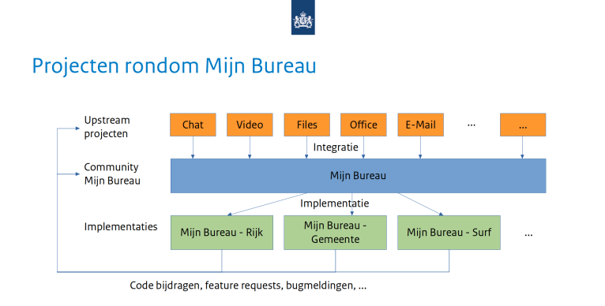

# Mijn Bureau project repository

Met [Mijn Bureau](index.md) onderzoeken we open source kantoorsoftware voor,
door en met overheden.

Mijn Bureau is een samenwerking van de Rijksoverheid, Gemeente Amsterdam en de
Vereniging Nederlandse Gemeenten.

Vanuit de Rijksoverheid werkt het projectteam van Open BSW van het programma
Beter Samen Werken aan Mijn Bureau. Zij documenteren hun werkwijze, proces en
geleerde lessen in deze repository in de [map openbsw](openbsw/index.md).

[Wat is Mijn Bureau?](index.md)

## Lifecycle fases voor broncode

Om onderscheid te maken tussen de broncode van de componenten en in welke mate
ze bruikbaar zijn merken we de code aan met de lifecycle phases uit de
PublicCode.yml standaard:

- Concept (`concept`) - De software is een “concept”. Er is geen code ontwikkeld
  die werkt of de repository is leeg.
- In ontwikkeling (`development`) - Er is software ontwikkeld welke nog niet
  klaar is voor de eindgebruiker, ook nog niet om uit te proberen.
- Proef (`beta`) - De software is in een The software is in een beproevingsfase.
- Stabiel (`stable`) - De software is in productie en kan als dienst worden
  aangeboden.
- Verouderd (`obsolete`) - De software word niet meer onderhouden.

## FAQ

### Hoe kan ik bijdragen?

Mijn Bureau is een integratielaag met als doel een breed bruikbaar
samenwerkplatform uit te rollen. Dit kunnen we niet alleen, we zoeken
nadrukkelijk een brede samenwerking op.

Deze samenwerking kan veel vormen hebben zoals:

- Tijd investeren. Meedenken, mee ontwikkelen, etc. via
  [open source werken](CONTRIBUTING.md) of andere methode.
- Repliceren binnen eigen organisatie, zodat we hier ervaringen uit kunnen
  opdoen en verbeteringen kunnen doorvoeren.
- Resources ter beschikking stellen
- etc...

Binnen dit project hanteren we hiervoor een [gedragscode](CODE_OF_CONDUCT.md)

### Wat is het bestuurlijke model van dit project?

Zie [Bestuur van Mijn Bureau](GOVERNANCE.md)

### Wat is het beveiligingsbeleid?

Zie [Beveiligingsbeleid](SECURITY.md)

### Hoe verhoudt Mijn Bureau zich tot omliggende projecten?

#### _Upstream communities_

Mijn Bureau integreert een reeks van uitwisselbare projecten om tot een
samenwerkomgeving te komen. Dit zijn bestaande of nieuwe (open) _communities_,
van binnen of buiten de overheid zijn. Zij leveren een product in de vorm van
een container image of plug-in. Deze moet voldoen aan [richtlijnen voor producten
in Mijn Bureau](openbsw/architectuur/index.md).

#### Mijn Bureau project

Het Mijn Bureau project is verantwoordelijk voor het
* opzetten en onderhouden van de infrastructuur configuratie,
* integreren van producten van upstream communities,
* actueel houden en code- en versie-beheer van deze integraties, 
* _security scanning_ op _deliverables_,
* handhaven van de Mijn Bureau [architectuur](openbsw/architectuur/index.md),
* input van buitenaf actief faciliteren,
* samenwerking onderhouden met _communities_ en implementerende partijen

#### Implementaties

Implementaties zijn de installatie van Mijn Bureau in een zelfstandige omgeving.
Hiervoor moeten de volgende zaken gedaan worden:
* De configuratie op basis van Mijn Bureau incl. keuze componenten,
* Verzorgen technisch beheer:
  * Incidenten
  * Monitoring
  * Performance
  * Etc.
* Verzorgen functioneel beheer:
  * Inrichting voor gebruikers (product configuratie)
  * Features en bugs aandragen aan bij _upstream communities_ of Mijn Bureau

---

Licentie: In licentie gegeven krachtens de
[EUPL (Openbare Licentie van de Europese Unie 1.2 of hoger)](LICENSE.md)

Copyright: de Staat der Nederlanden en alle bijdragers
