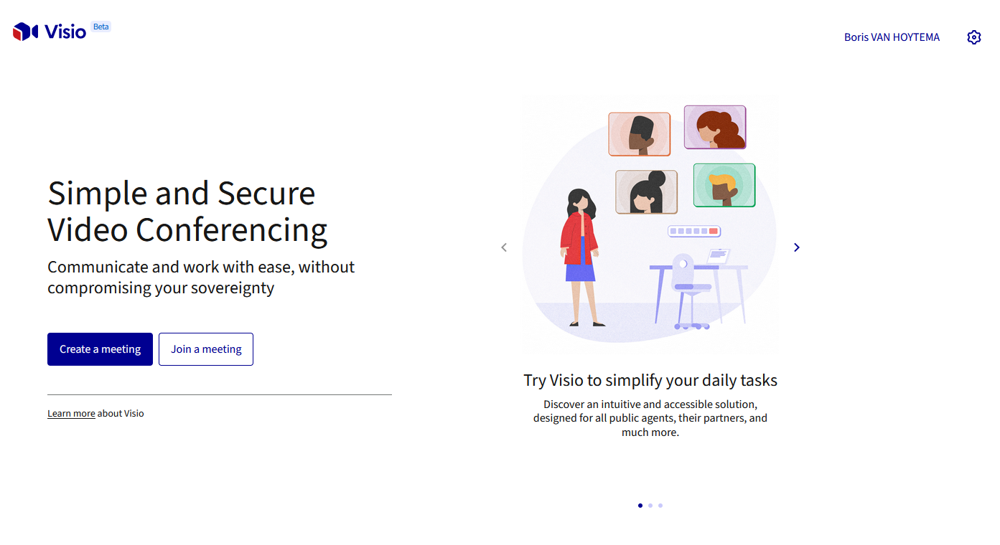

# Over Mijn Bureau

Mijn Bureau is een suite met samenwerksoftware voor de overheid, publieke sector en bedrijven.

De Mijn Bureau suite wordt ontwikkeld in samenwerking tussen verschillende partijen in Nederland onder regie van het Open source project van het Rijksbrede programma Beter Samen Werken: OpenBSW. De focus van dat project is op betere samenwerksoftware voor de Rijksoverheid. Dat waar maken is iets wat we echter niet alleen willen en kunnen. Daarom zoeken we actief de samenwerking met andere overheden, organisaties, bedrijven en ontwikkelaars.

Samen met Frankrijk en Duitsland onderhouden we een Europese suite van samenwerksoftware. Mijn Bureau is de Nederlandse implementatie daar van.

We gebruiken bewust componenten die we delen met veel en veel verschillende partijen. Zo worden de risico's gespreid en de investeringen gedeeld.

Dit is een initiatief van:

* [Rijksoverheid](https://www.rijksoverheid.nl/)
* Ministerie van Binnenlandse Zaken en Koninkrijksrelaties
* [Digilab](https://digilab.overheid.nl/)
* [Gemeente Amsterdam](https://www.amsterdam.nl/)
* [VNG-Realisatie](https://vng.nl/artikelen/vng-realisatie)

## Deeloplossingen

### Bureaublad

### Chat

Gedecentraliseerde chat voor teams en 1-1 communicatie

### Docs

Werk samen in real-time met notities

### Meet

Videovergaderingen zonder limieten

### Spreadsheets

Samen Spreadsheet maken en bewerken

### Files

Samenwerken aan Documenten, Spreadsheets en Presentaties

### Email

De email oplossing

### Kalender

Overzichtelijke planning voor moeiteloze samenwerking

### Taken

Beheer je taken efficiënt met een to-do lijst

### Projecten

Projectmanagement voor effectieve samenwerking, planning en uitvoering

### Kennis

Wiki-software voor slimme samenwerking en kennisbeheer

### Wachtwoord manager

Wachtwoord beheerder voor jouw persoonlijke en zakelijke veiligheid

### AI Assistant

Krijg ondersteuning van je eigen AI Assistant

### Account

Beheer uw gebruikersaccounts
