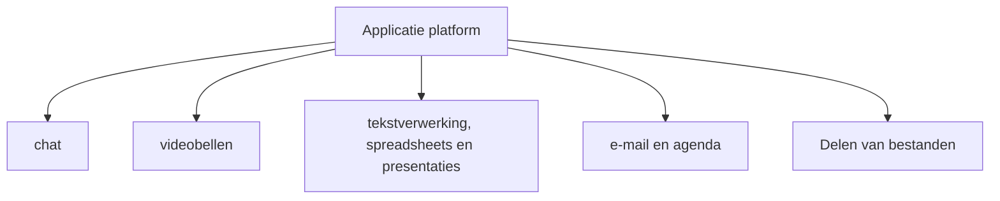
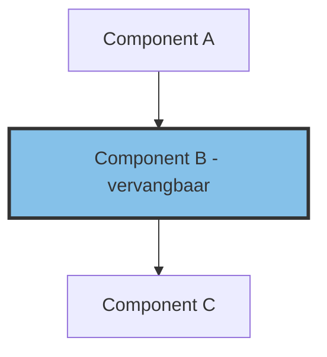

# Informatiearchitectuur

## Architectuur visie

MijnBureau is een toekomstgericht ecosysteem van open-source software, speciaal
ontworpen om ambtenaren te ondersteunen in hun werkprocessen. Het biedt een
reeks digitaal autonome diensten om zowel de huidige als toekomstige digitale
processen efficiënt te ondersteunen. Bovendien voldoet MijnBureau aan alle
beveiligingseisen en gegevensbeschermingseisen voor een veilige en compliant
gegevensverwerking.

De ontwikkelstrategie richt zich voornamelijk op het hergebruiken van
componenten uit OpenDesk en LaSuite, met enkele belangrijke aanpassingen die wij
als cruciaal beschouwen voor de flexibiliteit. Deze aanpassingen worden
aangevuld met specifieke onderdelen voor verbeterde integratie. Door maximaal
hergebruik bevorderen we de efficiënte uitvoering van MijnBureau en bevorderen
we de samenwerking met onze partners.

Verder willen we een best of breed methode toepassen zodat het mogelijk blijft
om componenten te blijven wisselen als dat nodig blijkt. Uiteindelijk moet de
keuze van componenten een goed gestructureerde systeem worden waarbij we
continue evalueren of de componenten nog bij de visie past. Momenteel hebben we
de voorkeur voor componenten uit LaSuite en OpenDesk, maar naarmate we meer in
de voor Nederland specifieke bedrijfsvoeringsvraagstukken komen dan is het
waarschijnlijk dat er ook andere ontwikkelde software in komt.

Ook zien we graag dat marktpartijen de MijnBureau suite kunnen gaan
mee-ontwikkelen, leveren, en beheren in opdracht van een publieke organisatie.
Dit zorgt ervoor dat er gekozen kan worden voor een aanbesteding en we
marktwerking krijgen binnen dit segment waar door meer overheden het kunnen
gebruiken.

## Informatiearchitectuur

De aanpak voor het creëren van MijnBureau is om open source-producten
(componenten) samen te voegen tot een universeel applicatie platform. Dit
betekent dat er een overkoepelende structuur gemaakt wordt waar open
source-producten toegevoegd kunnen worden. Het moet mogelijk worden om de
componenten aan en uit te zetten in de overkoepelende structuur. Maar ook moet
het mogelijk zijn om te integreren met al bestaande componenten binnen de
organisatie als deze een soortgelijke functie heeft zodat dubbelingen worden
voorkomen. Deze integratie met bestaande componenten moet via generiek
gestandaardiseerde protocollen/interfaces lopen.

De implementatie bestaat uit het identificeren van open source softwareproducten
die al beschikbaar zijn en grotendeels, bij voorkeur volledig, voldoen aan de
requirements. Als het product nog niet volledig voldoet moet er een plan komen
voor aanpassen van het product in overeenstemming met de open-source
maintainers. Als er geen overeenstemming gevonden kan worden moet er een
risicoanalyse gedaan worden of het product alsnog _as is_ gebruikt wordt of er
naar alternatieven gekeken gaat worden.

Zoals aangegeven wordt MijnBureau gecreëerd door een combinatie van open-source
producten, die zich op één functie focussen, te koppelen aan een applicatie
platform die deze componenten universeel kan uitrollen. Deze producten zullen
onderling met elkaar communiceren om een goed geïntegreerd systeem krijgen. Als
het product geen consistente compatibiliteit met gegevensformaten en
informatie-uitwisselingsprotocollen heeft moet er gekeken worden of dit
aangepast kan worden in overeenstemming met de open-source maintainers. Als de
aanpassing niet mogelijk is, moet de verbinding worden gemaakt via lossless
protocol converters.

Met betrekking tot het uitwisseling van informatie moeten vragen over wie, wat
en hoe worden verduidelijkt: wie mag met wie communiceren, wat is toegestane
communicatie-inhoud en hoe moet de inhoud worden geformatteerd. Dit resulteert
in de volgende technische en beveiligingsgerelateerde vereisten

- **Authenticatie**: Er moet vertrouwen zijn in wie een persoon is als deze
  informatie wil bevragen
- **Autorisatie**: Er moet gecontroleerd worden of de persoon toegang heeft tot
  de gevraagde informatie. Als dit niet mag, wordt de toegang geblokkeerd
- **Formaat**: Het kan zijn dat formaten geconverteerd moeten worden tussen
  input en output om me andere systemen te communiceren
- **Encryptie**: Encryptie is verplicht bij uitwisseling van informatie
- **Monitoring**: Alle communicatie wordt beveiligd door policies. monitoring
  wordt ingericht zodat de uitvoering van deze policies gecontroleerd kan
  worden.

### Formaten

De uitwisseling van berichten tussen mijnBureau producten moet
gestandaardiseerde interfaces gebruiken die gebaseerd zijn op open standaarden.
Dit is een vereiste voor onafhankelijkheid van de leverancier. De
berichtenuitwisseling moet een betrouwbaar transmissieprotocol gebruiken.
Voorbeelden van transmissie protocollen zijn AMQP, GraphQL, gRPC, MQTT, OpenAPI,
REST, SOAP. Voorbeelden van standard interface zijn HTTP, JWT, OpenDocument,
OOXML, XML.

### Veilige data toegang

Gegevenstoegang moet worden beheerd met behulp van policies dat de combinatie
van de identiteit van de aanvrager en toegangsrechten tot de gevraagde resource
evalueert. Het is raadzaam om identiteiten weer te geven met behulp van tokens
en toegangsrechten te valideren met behulp van op rollen gebaseerde
toegangscontrole (RBAC) of op kenmerken gebaseerde toegangscontrole (ABAC). Deze
aanpak beschermt vertrouwelijkheid met behulp van authenticatie en autorisatie.
Het moet mogelijk zijn om logging van gegevenstoegang te evalueren (accounting).

Een andere methode om vertrouwelijkheid te beschermen is data-encryptie. Dit kan
op dataopslag apparaten (encryption-at-rest) en tijdens datatoegang en
inter-process communicatie (encryption-in-transit). Sterke, quantumveilige
encryptiemethoden moeten worden gebruikt in overeenstemming met wet- en
regelgeving.

Voor het bewijzen van integriteit van data kunnen asymmetrische sleutels
gebruiken worden, alternatieven zijn checksums om de integriteit te bewijzen.

### Authenticatie standaard

Binnen MijnBureau zal OpenID Connect de standaard zijn. OpenID Connect is een
authenticatie- en autorisatie standaard gebaseerd op OAuth 2.0. OpenID Connect
is vandaag de dag de meest gebruikte standaard voor het authenticeren van
gebruikers in webapplicaties en API's.

Veel bedrijven gebruiken nog de SAML-standaard. Als men deze wil gebruiken moet
er een transformatie gedaan moeten worden door een tussenlaag die OpenID connect
kan omzetten naar SAML.

### Applicatie protocol standaarden

Er zijn al veel universele applicatie protocollen zodat applicaties met elkaar
kunnen communiceren binnen een domain. De volgende zijn de standaarden binnen
MijnBureau

**CalDAV** (Calendaring Extensions to WebDAV) is a protocol for managing
calendar data. WebOffice applications use CalDAV to synchronize and share
calendar data.

**CardDAV** vCard Extensions to WebDAV (CardDAV) is a client-server protocol for
address books to enable storage and sharing of contact data on a server.

**iCal** iCalendar (iCal) is a data format for exchanging calendar contents,
which is standardized in RFC 5545.

**IMAP** (Internet Message Access Protocol) connects endpoints with mail
servers. The protocol contains a text-based query language that mail user agents
placed in the endpoint can use to retrieve messages from the mail server. The
(personal) mailbox stored in the mail server is presented by IMAP as a kind of
file system.

**SCIM** (System for Cross-domain Identity Management) was developed for
managing and synchronizing identity data and access permissions for users and
resources (e.g. applications, files, email accounts) across different systems.
SCIM stores identity information such as usernames, email addresses, phone
numbers and group memberships in a central identity source. SCIM automatically
synchronizes changes to this identity information to all SCIM endpoints
associated with this identity source.

**SIP** Session Initiation Protocol (SIP) is a network protocol for
establishing, controlling and terminating a communication session between two or
more participants.

**SMTP** (Simple Mail Transfer Protocol) is the standard protocol for
transmitting emails over the Internet. WebOffice applications use SMTP to send
and receive emails.

**WebDAV** (Web-based Distributed Authoring and Versioning) is used to manage
files over the Internet. WebDAV allows files to be edited and shared over the
Internet.

**WebRTC** (Web Real-Time Communication) defines communication protocols and
programming interfaces that enable data exchange between any networked endpoints
in real time. This enables the integration of sophisticated multimedia
applications in the web browser, e.g. video conferences, file transfer or data
transmission, chat and desktop sharing.

## MijnBureau basis model

Het basismodel voor MijnBureau volgt in essentie het patroon dat een gebruiker
eerst verbindt met een portaal. Na succesvolle authenticatie laat het portaal de
mogelijke open-source producten zien. Het portaal kan het standaard portaal
binnen MijnBureau zijn, maar ook een eigen portaal die al bestaat binnen de
organisatie. De authenticatie kan geregeld zijn door een component binnen
MijnBureau, maar mag ook een eigen component van de organisatie zelf zijn, mits
ze de standaard claims ondersteunen vereist door MijnBureau componenten. De
producten opereren in een eigen groep containers die op een container platform
draait. De containers schalen horizontaal als er meer of minder gebruikers zijn.

API-gateways regelen de gegevensuitwisseling tussen de portal en componenten.
Enerzijds zijn deze bedoeld om de veilige en efficiënte gegevensuitwisseling van
en naar afzonderlijke modules te reguleren. Een algemeen API-beheersysteem moet
de API-gateways beheren en bewaken, de daarin toe te passen beleidsregels
afdwingen en indien nodig hun activiteiten loggen.

### Portaal

Het portaal is een grafische interface die een gebruiker de mogelijke
applicaties laat zien. Ook kan een geavanceerd portaal beschikbaar komen die
zaakgericht werken support.

Technisch personeel en beheerders hebben een eigen geïsoleerde portaal die
toegang geeft tot het beheren van alle generieke settings van MijnBureau.
Afhankelijke van hoe MijnBureau geconfigureerd is zal hieronder vallen
gebruikers management, autorisaties, beveiliging en informatie over de status
van het systeem.

### API Gateway

Als interface tussen de open source componenten en de eindgebruikers speelt de
API-gateway een centrale rol op het gebied van communicatie en
informatiebeveiliging. Het ontvangt requests van eindgebruikers en andere
modules. Daar zorgt het voor naleving van beveiligingsvereisten door richtlijnen
toe te passen. Op basis van deze beschermende maatregelen maakt het
systeem-tot-systeeminteracties mogelijk tussen de componenten en de backend
systemen.

De API-gateway is ontworpen met een focus op de veilige uitwisseling van
gegevens en services via API's (Application Programming Interfaces). Een
API-gateway biedt functies zoals authenticatie, autorisatie, API-beheer,
rate-limiting en bescherming tegen aanvallen. Een API-gateway maakt ook het
beheer van API's mogelijk, inclusief versiebeheer, documentatie en monitoring
van API-metrics.

Gelokaliseerde rate-limiting worden gebruikt om het aantal verzoeken te beperken
dat een enkele gebruiker of groep gebruikers binnen een bepaalde periode kan
uitvoeren. Dit beschermt de API tegen misbruik en helpt de beschikbaarheid en
stabiliteit van services te behouden. De API-gateway moet stateless zijn, dit
zorgt ervoor dat het schaalbaar blijft.

### Monitoring

Systeemmonitoring biedt de mogelijkheid om te zien of alle componenten goed
werken. Het biedt de mogelijkheid om controle te hebben over het systeem door
beheerders. Ook maakt het mogelijk om auditing en logging toe te passen en
misbruik of fouten op te sporen.

### Componenten

De componenten moeten onafhankelijk van elkaar zijn, maar wel integreerbaar over
standaard interfaces waar mogelijk. De kracht van het MijnBureau systeem is dat
we componenten kunnen uitwisselen voor andere componenten als dat nodig is. Het
algehele MijnBureau systeem moet het dus mogelijk maken om componenten toe te
voegen, vervangen of verwijderen, bij voorkeur gebeuren deze veranderingen
terwijl het systeem blijft draaien. Intelligent versie beheer is hierin dan ook
cruciaal.

## Functionele vereisten

Hieronder wordt aangegeven wat we verwachten per functioneel component

### Portal

Het portaal is een centraal aanspreekpunt voor verschillende eindgebruikers

| ID          | Titel                                                      | vereiste |
| ----------- | ---------------------------------------------------------- | -------- |
| MBPORTAL-01 | Login met gebruikersnaam en wachtwoord                     | Must     |
| MBPORTAL-02 | 2 Factoren Authenticatie                                   | Must     |
| MBPORTAL-03 | Product lijst                                              | Must     |
| MBPORTAL-04 | Zaakgericht werken                                         | Should   |
| MBPORTAL-05 | Gebruikersinterface kan worden aangepast in de lokale taal | Must     |
| MBPORTAL-06 | Gebruikersinterface via de webbrowser                      | Must     |
| MBPORTAL-07 | Documenten overzicht                                       | Should   |

### Tekstverwerking, Spreadsheets en Presentaties

Dit component bestaat uit meerdere producten en worden vaak onder de
verzamelnaam office tools genoemd.

De overkoepelende eisen zijn

| ID          | Titel                                                      | vereiste |
| ----------- |------------------------------------------------------------| -------- |
| MBOFFICE-01 | Gebruikersinterface via de webbrowser                      | Must     |
| MBOFFICE-02 | Gebruikersinterface kan worden aangepast in de lokale taal | Must     |
| MBOFFICE-03 | Zaakgericht werken                                         | Should   |
| MBOFFICE-04 | Archivering                                                | Must     |
| MBOFFICE-05 | Versies                                                    | Must     |

De eisen voor text verwerking zijn

| ID           | Titel                                       | vereiste |
| ------------ | ------------------------------------------- | -------- |
| MBOFFICET-01 | Layoutsjablonen beschikbaar                 | Must     |
| MBOFFICET-02 | Grafische afbeeldingen vrij te positioneren | Must     |
| MBOFFICET-03 | Opmerkingen                                 | Must     |
| MBOFFICET-04 | Wijzigingen bijhouden                       | Must     |
| MBOFFICET-05 | Tabellen                                    | Must     |

De eisen voor spreadsheets zijn

| ID           | Titel                                    | vereiste |
| ------------ | ---------------------------------------- | -------- |
| MBOFFICES-01 | Rijen en/of kolommen weergeven/verbergen | Must     |
| MBOFFICES-02 | Opmaak van gegevenstype van de celinhoud | Must     |
| MBOFFICES-03 | samenvoegen cellen                       | Must     |
| MBOFFICES-04 | Numerieke functies                       | Must     |
| MBOFFICES-05 | Verwijzingen naar andere cellen          | Must     |

De eisen voor presentaties zijn

| ID           | Titel                                 | vereiste |
| ------------ | ------------------------------------- | -------- |
| MBOFFICEP-01 | Layoutsjablonen beschikbaar           | Must     |
| MBOFFICEP-02 | Vrije combinatie van tekst en grafiek | Must     |
| MBOFFICEP-03 | Notities                              | Must     |
| MBOFFICEP-04 | Grafische diagrammen tooling          | Must     |
| MBOFFICEP-05 | Timer ondersteuning                   | Should   |

### Chat

| ID        | Titel                                                      | vereiste |
| --------- | ---------------------------------------------------------- | -------- |
| MBCHAT-01 | Applicatie, desktop en webinterface                        | Must     |
| MBCHAT-02 | Gebruikersinterface kan worden aangepast in de lokale taal | Must     |
| MBCHAT-03 | Groepen                                                    | Must     |
| MBCHAT-04 | Contactpersonen vinden                                     | Must     |
| MBCHAT-05 | Versleutelde berichten                                     | Must     |
| MBCHAT-06 | Contactpersonen                                            | Should   |
| MBCHAT-07 | Archivering                                                | Must     |
| MBCHAT-08 | Zaakgericht werken                                         | Should   |

### E-mail en agenda

| ID             | Titel                                                      | vereiste |
| -------------- | ---------------------------------------------------------- | -------- |
| MBGROUPWARE-01 | Applicatie, desktop en webinterface beschikbaar            | Must     |
| MBGROUPWARE-02 | Gebruikersinterface kan worden aangepast in de lokale taal | Must     |
| MBGROUPWARE-03 | Zaakgericht werken                                         | Should   |
| MBGROUPWARE-04 | Zoekfunctie                                                | Must     |
| MBGROUPWARE-05 | Contacten vinden                                           | Must     |
| MBGROUPWARE-06 | Agenda connectie met videobellen                           | Must     |
| MBGROUPWARE-07 | Functionele mailbox                                        | Must     |
| MBGROUPWARE-08 | Out of office notificatie                                  | Must     |
| MBGROUPWARE-09 | Mapstructuur                                               | Must     |
| MBGROUPWARE-10 | Versleuteling van berichten                                | Must     |
| MBGROUPWARE-11 | Ontvangst en lees bevestiging                              | Must     |

### Videobellen

| ID         | Titel                                                      | vereiste |
| ---------- |------------------------------------------------------------| -------- |
| MBVIDEO-01 | Gebruikersinterface via de webbrowser                      | Must     |
| MBVIDEO-02 | Gebruikersinterface kan worden aangepast in de lokale taal | Must     |
| MBVIDEO-02 | Integratie met chat en agenda                              | Must     |
| MBVIDEO-03 | Opnemen en samenvattingen van meetings                     | Should   |
| MBVIDEO-04 | Toegangsbeheer tot meetings                                | Must     |
| MBVIDEO-05 | Integratie met terminals op kantoor                        | Should   |
| MBVIDEO-05 | Zaakgericht labelen                                        | Must     |

### Delen van bestanden

De opslag van bestanden in de centrale gegevensruimte

| ID        | Titel                                            | vereiste |
| --------- | ------------------------------------------------ | -------- |
| MBFILE-01 | Navigatie van het bestandssysteem met webbrowser | Must     |
| MBFILE-02 | Versieren van bestanden                          | Must     |
| MBFILE-03 | Zaak gericht labelen                             | Should   |
| MBFILE-04 | Toegangsbeheer tot bestanden                     | Must     |
| MBFILE-05 | Zaakgerichte groepen                             | Should   |
| MBFILE-06 | Informatiehuishoudingsverstrekking               | Must     |
| MBFILE-07 | Gestructureerde opslag van documenten            | Must     |

## Product model

MijnBureau is opgebouwd uit open-source componenten, gecombineerd door een
infrastructuur code laag. De infrastructuur code laag wordt open-source
gepubliceerd en onderhouden door een core team. Iedereen mag bijdragen aan deze
infrastructuur, maar de kwaliteit en relevantie wordt beoordeeld door het core
team. Deze infrastructuur laag combineert alle applicaties tot een samenhangend
geheel. De infrastructuur laag moet flexibel genoeg zijn om meerdere setups van
MijnBureau te ondersteunen. Iedere organisatie kan dan zijn eigen configuratie
instellen voor de infrastructuur laag, zodat ze hun eigen variant creëren van
MijnBureau. Dit kan door componenten uit en aan te zetten, maar ook door
vervangende componenten te configureren. Men kan zelfs eigen versies van
containers inbrengen i.p.v. de standaard open-source containers. Men wordt dan
wel zelf verantwoordelijk voor de security van die containers.

De broncode van de componenten blijft in beheer van de open source product
maintainers. Veranderingen moeten dan ook met de open-source maintainers
overlegd en doorgevoerd worden. Deze verandering kan door iedereen gemaakt
worden. Men kan een bedrijf hiervoor inhuren, eigen developers gebruiken of de
maintainers betalen. Als er security issues zijn met de container moeten deze
bij de core maintainers opgelost worden van het betreffende product.

Als MijnBureau een versie krijgt, worden alle bijbehorende product containers
gescand, de versies worden vastgezet en de dependencies worden opgehaald en
gepubliceerd. Ook worden de open-source licenties van alle componenten verzameld
en weergegeven. Deze maatregelen zorgen ervoor dat er goed herleidbaar is waar
risico's zijn en welke licenties gebruikt worden

Wanneer een organisatie MijnBureau wil gebruiken hoeven ze alleen de
configuratie te kiezen en de installatie uit te voeren. De component versies
worden vastgezet tijdens de installatie, het bewijs van kwaliteit kan worden
bevestigd door een test suite, en door versiebeheer kan de bijbehorende
informatie gevonden worden tijdens het genereren van een MijnBureau release. Dit
zorgt ervoor dat alles traceerbaar blijft.

### Testen

Nadat componenten geïntegreerd zijn met MijnBureau moeten er geautomatiseerde
testen uitgevoerd worden om te bewijzen dat de interfaces en functionaliteiten
werken zoals verwacht. Dit betekent dat en End2End testen uitgevoerd worden op
de functionaliteiten die beschikbaar moeten zijn. Verder moeten integratie
testen gedaan worden op de interfaces tussen de componenten en er moeten
belastingtesten gedaan worden om te kijken of de componenten de belasting aan
kan en goed schaalt.

### Container image

MijnBureau gaat uit dat er een container-as-a-service platform gebaseerd op
Kubernetes beschikbaar is binnen de organisatie. Alle open-source componenten
moeten daarom als container images voorbereid worden. Ook moeten infrastructuur
deploy code beschikbaar zijn om deze containers op een universele manier
beschikbaar te maken. Idealiter zouden alle dependencies hardend moeten zijn
zodat er een minimaal oppervlak is voor aanvallen is die misbruik van de
container mogelijk maakt.

Binnen MijnBureau kunnen we gebruik maken van de open source provided
containers, of als we meer controle willen kunnen we een eigen container
registry starten waar alleen goedgekeurde containers in komen te staan. Hierbij
kunnen we de containers scannen op malware, software bill of materials creëren
en licentie lijsten genereren. Ook kunnen was attestation vereisen van
containers en artifacts ondertekent zodat gecontroleerd kan worden dat de
containers rechtmatig door MijnBureau gecontroleerd is.

## Security service model

MijnBureau maakt gebruik van AAA-security en Zero Trust. AAA staat voor
Authentication, Authorization and Accounting. Zero trust gaat ervan uit dat
iedere aanvraag gevalideerd moeten worden. Voordat toegang verleend worden moet
een gebruiker of apparaat een niveau van vertrouwen bewijzen.

Verder zorgt het MijnBureau systeem voor het volgende:

- De integriteit en vertrouwelijkheid van access log data,
- Vastleggen van alle relevante gebeurtenissen en activiteiten in relatie tot
  API-communicatie,
- Implementeren van mechanismes om te voorkomen dat log data gemanipuleerd of
  verwijderd wordt en
- Gebruik van cryptografische methoden om de integriteit en vertrouwelijkheid
  van data gewaarborgd is tijdens transport.

Verder moeten de login en refresh-tokens kortdurend zijn. Dit zorgt ervoor dat
het risico geminimaliseerd wordt dat een aanvaller bij resources kan door tokens
te stelen.

Voor machine-2-machine communicatie moeten de tokens regelmatig gerouleerd
worden, waarbij de oude token geïnvalideerd wordt.

## Deploy model

De applicatie deployment is geautomatiseerd via continuous integration /
continuous deployment (CI/CD) pipelines. Tools, pipelines en configuratie wordt
centraal in een versie beheer systeem bijgehouden.

De focus op modulariteit, specifiek op uitwisselbare open source software, richt
zich op de operationele en zakelijke doelen van flexibiliteit en
kostenefficiëntie. Adapter-ondersteunde specialistische procesintegraties maken
een verbinding naar administratieve specialistische applicaties mogelijk. De
vereisten die hiervoor nodig zijn, zijn al in het totale systeem opgenomen en
dergelijke uitbreidingen vereisen geen uitgebreide wijzigingen in de
onderliggende infrastructuur.

MijnBureau moet kunnen draaien op een haven compliant infrastructuur basis.
Developers en security specialisten kunnen MijnBureau verbeteren met betrekking
tot performance en beveiliging door contributies te leveren aan de upstream
componenten of het basis infra systeem. Al met al is MijnBureau zo transparant
mogelijk zodat iedereen kan meekijken en meehelpen.

Security by Design is een basis principe en moet dus ook bij het deployment
meegenomen worden. In deze context worden zowel de BIO-richtlijnen als de
operationele stabiliteit volgens de IT Infrastructure Library (ITIL) en best
practices voor MijnBureau in acht genomen. Zero Trust speelt een centrale rol
bij MijnBureau, omdat het een restrictieve aanpak volgt waarbij geen enkele
gebruiker of apparaat standaard vertrouwen krijgt en toegangsrechten worden
verleend op basis van behoefte en verificatie.

## Open Source criteria

Alle open-source componenten moeten een geaccepteerde licentie hebben, anders
kan deze niet geïntegreerd worden. De binaire vorm van de open source
componenten moet van voldoende kwaliteit zijn zodat de stabiliteit en veiligheid
binnen de risico marges vallen. Ook moeten de functionaliteiten die vereist zijn
in het product aanwezig zijn. Verder moet het mogelijk zijn om de software op
andere platformen en operating systemen beschikbaar te maken. Dit zorgt ervoor
dat de autonomie ook verder rijk dan de processor en operating systeem van een
leverancier.

## Accessibility

Het doel van Accessibility binnen MijnBureau is dat ambtenaren met beperkingen
gelijke toegang hebben tot MijnBureau. Hierbij refereren we aan de Web Content
Accessibility Guidelines (WCAG) standaard. MijnBureau moet visuele, auditieve en
fysieke toegang en bedieningsopties bieden. Om dit te bereiken, moeten alle
gebruikersgerichte systemen, applicaties en omgevingen worden uitgebreid met
digitale inclusie.

Als de applicaties niet voldoen moeten een plan komen om deze op middellange
termijn compliant te maken.

#### Uniformiteit

Het is belangrijk voor de gebruiker dat de gebruikers interface er overal
hetzelfde uitziet. Gebruikers moeten niet zoeken naar knoppen en overal dezelfde
ervaring krijgen zover dat mogelijk is. Dit betekent zelfde kleurstellingen en
contrasten, icoontjes en processen.

Een User Interface systeem maakt een uniforme ervaring mogelijk door
herbruikbare UI-componenten in verschillende delen van de software te gebruiken.
Dit betekent dat er een design system moet zijn, uniforme ontwerprichtlijnen en
consistente interacties om ervoor te zorgen dat alle elementen van de
gebruikersinterface uniform zijn ontworpen. Dit bespaart tijd en middelen omdat
ontwikkelaars en ontwerpers de herbruikbare componenten van het systeem kunnen
gebruiken in plaats van telkens nieuwe elementen te ontwerpen. Het UI-systeem
moet schaalbaar en flexibel zijn en zich gemakkelijk kunnen aanpassen aan
veranderende vereisten. Over het geheel genomen verbetert het de
gebruikerservaring en -tevredenheid door een uniform bedieningsconcept.

Binnen de Nederlandse overheid bestaan al verschillende design systemen. Een van
deze moeten we gaan hergebruiken.

## Agile Component Methode

Om componenten snel waarde te laten creëren en issues in de vereisten en wensen
te detecteren is het van belang om componenten snel beschikbaar te maken voor
gebruikers. Hierdoor kunnen we snel feedback krijgen en iteraties maken voor
verbeteringen. Hiervoor stellen we een agile werkmethode voor.

Dit betekent dat een component in verschillende fases kan zitten, en dat we
iteratief verbeteringen door voeren met betrekking tot bijvoorbeeld
accessibility en uniformiteit. Zolang we aan de gebruiker duidelijk maken in
welke fase een product zit schept dit ook de juiste verwachtingen.

We stellen de volgende fases voor:

- Alpha: alleen voor intern gebruik door experts
- Beta: user feedback verkrijgen van grotere groep gebruikers buiten de experts
- Productie: bruikbaar voor iedereen

De minimale vereisten is dat het product binnen de risico marges valt van
security voordat het naar alpha mag. Een risico beoordeling moet goedgekeurd
zijn om naar beta toe te mogen. Voor productie moet er weer een risico
beoordeling goedgekeurd zijn voor het desbetreffende component.

## Lees verder
- [Business architectuur](business-architectuur.md)
- [Technische architectuur](techniche-architectuur.md)

Of keer terug naar de [hoofdpagina](index.md)
