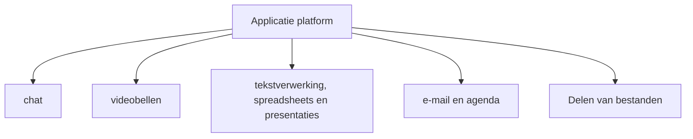
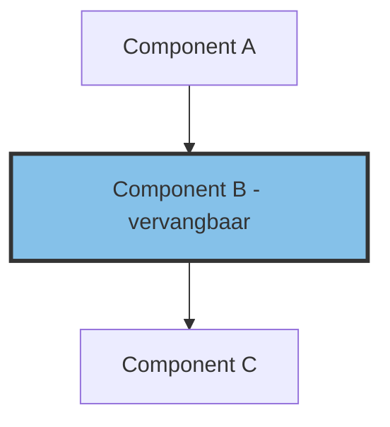

# Solution architectuur Mijn Bureau (DRAFT)

Dit document beschrijft de solution architectuur van Mijn Bureau. Mijn Bureau is een Digitale Werkomgeving voor ambtenaren samengesteld uit open-source componenten. De nadruk van dit systeem ligt op veiligheid, gebruiksvriendelijkheid, informatie huishouding en digitale autonomie. Het systeem is geïnspireerd op [OpenDesk](https://opendesk.eu/en/) en [La-Suite](https://lasuite.numerique.gouv.fr/).

## Samenvatting

De architectuur is gericht op het faciliteren van een schaalbare, veilige en gebruiksvriendelijke digitale werkomgeving waarbij goede informatie huidhouding gewaarborgd wordt. Ook wordt alle relevante wet- en regelgeving meegenomen in deze architectuur. Denk hierbij aan de archiefwet, Wet Open Overheid, Informatie & cyber beveiliging regelgeving en Privacywetgeving.

De architectuur sluit waar mogelijk aan bij [common ground](https://commonground.nl/). Common Ground is de visie die beschrijft hoe gemeenten hun informatievoorziening willen inrichten.

MijnBureau is een toekomstgericht ecosysteem van open-source software. De ontwikkelstrategie richt zich voornamelijk op het hergebruiken van componenten uit OpenDesk en LaSuite, met enkele belangrijke aanpassingen die wij als cruciaal beschouwen voor de flexibiliteit. Deze aanpassingen worden aangevuld met specifieke onderdelen voor verbeterde integratie en zaakgericht werken. Door maximaal hergebruik bevorderen we de efficiënte uitvoering van MijnBureau en bevorderen we de samenwerking met onze partners.

De aanpak voor het creëren van MijnBureau is om open source-producten samen te voegen tot een universeel applicatie platform. Dit betekend dat er een overkoepelende structuur gemaakt wordt waar open source-producten toegevoegd kunnen worden, en weggehaald kunnen worden. Het moet mogelijk worden om de componenten aan en uit te zetten in de overkoepelen structuur maar ook moet het mogelijk zijn om te integreren met al bestaande componenten binnen de organisatie als deze een soortgelijke functie heeft zodat dubbelingen worden voorkomen. Deze integratie met bestaande componenten moet via generiek gestandaardiseerde protocollen/interfaces lopen.

Bij de selectie van componenten wordt rekening gehouden met beheerbaarheid, open interfaces en standaarden, open-source en gebruik door partners.

## Aanleiding

Ministeries gebruiken eigen systemen om informatie te registreren en te archiveren. Uit verschillende onderzoeken blijkt dat de huidige systemen niet gebruiksvriendelijk zijn ingericht. Geordende vastlegging vindt pas laat plaats, interdepartementaal samenwerken is lastig, en bewaren en vernietigen van informatie gebeurt nog onvoldoende gecontroleerd. Daardoor is er kritiek op de transparantie van het Rijk en lukt het vaak niet om informatieverzoeken van burgers binnen de wettelijke termijnen af te ronden. Om dit te verhelpen hebben 4 departementen het BSW programma gestart. Na een rapport van AC-ICT over BSW heeft BSW OpenBSW gestart om te kijken naar OpenSource alternatieven voor de BSW functionaliteiten.

### Introductie Beter Samen Werken (BSW)

Het Programma Beter Samen Werken is gestart op Februari 2023 en betreft een programma van vier ministeries:

- Financiën
- Volksgezondheid, Welzijn en Sport (VWS)
- Sociale Zaken en Werkgelegenheid (SZW)
- Binnenlandse Zaken en Koninkrijksrelaties (BZK)

In het programma BSW werken vier departementen samen aan het verbeteren van de informatiehuishouding (IHH) door het vernieuwen van de ICT-ondersteuning. Rijksbreed is
afgesproken dat andere departementen de gerealiseerde oplossing later kunnen overnemen.

BSW wil komen tot een voor ambtenaren duidelijk betere en gebruiksvriendelijke ondersteuning van het werkproces en de informatiehuishouding. ook willen ze een systeem realiseren die kan voldoen aan de [Archiefwet](https://wetten.overheid.nl/BWBR0007376/2024-06-19) en de [Wet open overheid](https://wetten.overheid.nl/BWBR0045754/2025-02-12).

De Doelarchitectuur van Beter Samenwerken (BSW) is het bieden van een toekomstgerichte en robuuste basis voor de digitale informatiehuishouding van overheidsorganisaties.

### Introductie OpenBSW

In het [rapport](https://www.adviescollegeicttoetsing.nl/onderzoeken/documenten/publicaties/2024/09/02/advies-beter-samen-werken) van Adviescollege ICT dat afgerond werd op mei 2024 werd aan BSW een aantal adviezen gegeven. Een aantal van deze adviezen volgende in juni 2024 tot een voorstel om het project Open BSW te starten als onderdeel van het BSW Programma. De uitvoering van OpenBSW start op 1 december 2024 met de start van de projectleider, op 1 januari 2025 start de eerste engineer.

Het project is in toenemende mate van belang als gevolg van kamer vragen rondom de risico’s die verbonden zijn aan het gebruikt van Cloud en de autonomie van Nederland zoals de initiatief nota ['Wolken aan de horizon'](https://www.rijksoverheid.nl/documenten/kamerstukken/2025/01/17/kamerbrief-initiatiefnota-wolken-aan-de-horizon) en het kamer debat [migraties van overheids-ICT naar het buitenland](https://www.tweedekamer.nl/debat_en_vergadering/plenaire_vergaderingen/details/activiteit?id=2024A08625).

Het doel van het originele openBSW voorstel van 2024 is om een Proof of Concept uitwerking van Beter Samen Werken (BSW) functionaliteiten in te richten die de autonomie van de overheid versterkt met open source. Hiervoor word gekeken naar [LaSuite](https://lasuite.numerique.gouv.fr/en), [OpenDesk](https://opendesk.eu/en/), [Common Ground](https://commonground.nl/) en een EU initiatief. Er is een budget van 445.000 euro. Op Februari 2025 is er een werkende uitvoering van de functionaliteiten zoals beschreven in de BSW architectuur voor de samenwerkruimte.

In maart 2025 worden rapporten opgeleverd aan het programma BSW met een voorstel om pilots te starten. Het voorstel is om geselecteerde beproefde producten verder te verkennen met gebruikers en te voldoen aan alle wet en regelgeving, accessability eisen etc.

De ontwikkelrichting voor de pilot is voornamelijk het hergebruik van OpenDesk en LaSuite maar met een paar significante aanpassingen. Deze aanpassingen zijn vam cruciaal belang voor het gebruik door onze organisaties en ambtenaren. Ook worden de suites aangevuld met specifieke onderdelen voor integratie met informatie huishoudings systemen.

Deze solution architectuur is een gevolg van het voorstel voor pilots.

## Introductie architectuur

Dit document beschrijft de solution architectuur voor mijn bureau. Mijn Bureau is een autonome Digitale Werkomgeving. Een groot deel van de architectuur is geïnspireerd op de [architectuur van OpenDesk](https://gitlab.opencode.de/bmi/opendesk-architekturkonzept/).

### Doel van dit document

Het doel is het definiëren van een oplossing voor de digitale Werkomgevings met als uitgangspunten een autonome oplossing die voldoet aan alle wet- en regelgeving en schaalbaar is naar 60.000 gebruikers.

Dit document is bedoeld als discussie en richtinggevend document voor alle stakeholders om MijnBureau te implementeren. Wij hopen dat personen of organisaties die impact voelen door dit systeem mee wil werken aan dit document en belangrijke punten willen aandragen vanuit de expertise die zij hebben.

### Business doel

MijnBureau heeft tot doel de ministeries en ook voor daaraan verbonden agentschappen, inspecties en uitvoeringsinstellingen, evenals Hoge Colleges van Staat, provincies en gemeenten in staat te stellen om werkprocessen van ambtenaren te ondersteunen, die geheel of gedeeltelijk afhankelijk zijn van een goede informatiehuishouding, met een digitale werkomgeving. Dit willen we op een gestandaardiseerde en autonome manier kunnen aanbieden. MijnBureau wil daarmee een belangrijke bijdrage leveren aan de modernisering van de informatie huishouding en de digitale autonomie van de overheid. Verder willen we met mijn bureau de ambtenaren ondersteunen met een geavanceerd en toekomstbestendig werkomgeving, en deze staat zou uiterlijk op de middellange termijn moeten worden bereikt.

verwacht wordt dat MijnBureau de grootste toegevoegde waarde kan leveren op informatiehuishouding en autonomie.

#### Business principes

Om mijn bureau kostenefficiënt te ontwikkelen, zijn er een aantal businessprincipes opgesteld die erop gericht zijn complexiteit en kosten in balans te brengen. Deze principes dienen als leidraad om strategische beslissingen te maken die zowel de effectiviteit als de financiële gezondheid van MijnBureau waarborgen. Door systematisch complexiteit te reduceren, kunnen processen worden gestroomlijnd, wat leidt tot aanzienlijke kostenbesparingen zonder in te boeten op kwaliteit of innovatie

##### Economische efficiëntie

Bij het selecteren en exploiteren van een componenten voor mijn bureau moeten altijd de aspecten van economische efficiëntie en andere aspecten zoals duurzaamheid, toegankelijkheid, etc. in acht worden genomen. Als het verwachte voordeel onevenredig laag is in vergelijking met de kosten, dan moeten er alternatieven worden gezocht.

##### Confidentiality, Integrity and Availability

Beschermingsbehoeften worden doorgaans maximaal ingesteld voor de doelen van beschikbaarheid, vertrouwelijkheid en integriteit, maar het toepassen van het maximale niveau op alles kan leiden tot onnodige inspanningen, met name met betrekking tot beschikbaarheid. Het bereiken van buitensporige beschikbaarheid vereist vaak redundante technische componenten, wat kostbaar kan zijn. Daarom is het cruciaal om de beschermingsdoelen grondig te bespreken en te evalueren. Als ononderbroken bedrijfsactiviteiten cruciaal zijn, moet een "hoog" niveau van beschikbaarheid worden geïmplementeerd op applicatieniveau, wat de betrokken kosten rechtvaardigt. Als dit niet zo is, kan gekeken worden naar lagere beschikbaarheid.

##### Standaarden

Sluit aan bij wereldwijde standaarden zonder af te wijken van vastgestelde eigen normen. Door gebruik te maken van gestandaardiseerde processen, interfaces en data-uitwisselingsformaten wordt goede samenwerking tussen partijen mogelijk, wat cruciaal is voor het bereiken van efficiëntie digitale werkomgeving.

### Samenwerking

Mijn Bureau wordt gecreëerd in een collaboratieve samenwerking waarbij wordt samengewerkt met ministeries, gemeenten, provincies, uitvoeringsorganisaties, collega-organisaties in andere landen en relevante open-source gemeenschappen. De softwarebasis is samengesteld uit bestaande open source ecosystemen.

Nederland heeft in december 2024 een intentieverklaring getekend met Duitsland en Frankrijk, ondertekend door CIO Rijk namens de staatssecretaris van BZK, om de betrokkenheid en samenwerking op het gebied van autonome digitale werkomgeving te formaliseren met onze Franse en Duitse collega's.

Ons doel is om een softwaresuite samen te stellen met een installatie laag die niet alleen geschikt is voor de Rijksoverheid, maar ook herbruikbaar en aanpasbaar is voor mede-overheden en de gehele publieke sector. Voor een efficiënte ontwikkeling van Mijn Bureau is samenwerking met ervaren partners cruciaal. We kijken daarbij naar de Franse en Duitse collega's, diverse eigen instellingen zoals gemeenten en uitvoeringsorganisaties, en organisaties zoals SURF die al geavanceerde componenten gebruiken die binnen Mijn Bureau kunnen worden toegepast.

Verschillende overheidsorganisaties zoals SSC-ICT, DICTU en RvIHH beschikken over uitgebreide kennis op het gebied van beheer en informatie huishouding, die we willen inzetten om te voldoen aan de geldende wet- en regelgeving en om bestaande processen te hergebruiken. Samen met de levendige open-source gemeenschap en bedrijven die open-source diensten aanbieden, kunnen we een voortreffelijk product creëren.

#### Project structuur

Het voorgestelde projectstructuur voor OpenBSW is opgesplitst in 3 niveaus:

##### Strategisch Niveau

Doel: Bepaal de strategie, visie en lange termijn doelen van het project.

Leden: vertegenwoordigers van de rijksoverheid, uitvoeringsorganisaties, provincies, gemeenten en belangrijke stakeholders.

Verantwoordelijkheden :

- Beslist over de toewijzing van middelen en prioritering van projecten.
- Zorgt voor afstemming met politieke en financiële doelstellingen.
- Faciliteert een open communicatie- en besluitvormingsproces.

##### Tactisch Niveau

Doel: Ontwerpen van specifieke sub-componenten en bewaken van projectvoortgang.

Leden: Projectmanagers en solution architect

Verantwoordelijkheden:

- Vertalen van strategische doelen naar concrete plannen en roadmaps.
- Toezicht houden op project control mechanismen zoals tijdslijnen en budgetbewaking.
- Coördineren van communicatie tussen het strategische en operationele niveau.
- Architectuur principes van MijnBureau bewaken

##### Operationeel Niveau

Doel : Implementeren en testen van projectcomponenten.

Leden : Technische teams, productontwikkelaars, testers, en gebruikerservaringsexperts.

Verantwoordelijkheden :

- Implementeren van sub-componenten in het MijnBureau systeem.
- Zet in op continue integratie en deployment (CI/CD) voor efficiënte updates.
- Faciliteren van feedback loops via een productbord, een architectuurbord, en een gebruikerservaringsbord.
- Het product-, architectuur-, en gebruikerservaringsbord dienen als adviesorganen die voortdurend communiceren met alle deelprojecten en ondersteunen bij iteratieve verbeteringen.

### Fases

Mijn Bureau zal bestaan uit meerde componenten, voor ieder component zullen we fases doorgaan.

- Planning – verzameling van vereisten
- Constructie – transformatie van vereisten naar dienstverlening
- Exploitatie – levering van diensten in overeenstemming met de toepasselijke service level agreements

### Architectuur principes

In de dynamische wereld van softwareontwikkeling vormen architectuurprincipes de hoeksteen van een effectief en robuust systeemontwerp. Deze principes bieden richtlijnen die ervoor zorgen dat een systeem niet alleen voldoet aan de huidige eisen, maar ook flexibel genoeg is om toekomstige uitdagingen aan te gaan. Ze fungeren als een leidraad voor zowel ontwikkelaars als stakeholders, en bevorderen een gemeenschappelijk begrip en consistente besluitvorming tijdens de levenscyclus van het softwareproject.

#### 1 Conformiteit met Wet- en Regelgeving

Zorg ervoor dat het systeem voldoet aan alle relevante wettelijke en regelgevende vereisten. Voorbeelden hiervan zijn AVG, BIO2, Archiefwet en forumstandaardisatie richtlijnen.

#### 2 Gebruik van standaarden

Implementeer gevestigde marktstandaarden om interoperabiliteit, beveiliging en innovatie te bevorderen. Voorbeelden hiervan zijn WebDav, CalDav en OpenID Connect.

#### 3 Digitale Autonomie & Leveranciersonafhankelijkheid

Beheer en controle gegevens binnen geografische en juridische grenzen en minimaliseer afhankelijkheid van specifieke leveranciers of fabrikanten om flexibiliteit en keuzevrijheid te behouden. Voorbeelden zijn open data formaten zoals ODF. Indien mogelijk dient uitsluitend softwarecomponenten te bevatten waarvoor functioneel vergelijkbare producten beschikbaar zijn.

#### 4 Maximaliseer Hergebruik

Bevorder het hergebruik van bestaande componenten en technologieën om efficiëntie te verbeteren en kosten te reduceren. Dit betekend dat tijdens het planning process goed gekeken moet worden naar mogelijke componenten die al bestaan voordat nieuwe componenten gemaakt worden. Als men iets nieuws maakt probeer dan aan te sluiten bij bestaande standaarden tijdens de implementatie.

#### 5 Security by design

Implementeer veilige configuraties en beveiliging als standaarduitgangspunt binnen het systeemontwerp. Beveiliging moet in iedere fase van de ontwikkeling meegenomen worden, Niet alleen in de ontwerpfase.

#### 6 Gebruikersgerichte Ontwikkeling

Betrek gebruikers in het proces om een hoge bruikbaarheid en acceptatie te verzekeren. Denk hierbij aan User Experience onderzoeken zoals functionele geschiktheid en SUS scores.

#### 7 Container native & Beheerbaar

Adopteer een container-native ontwerp om optimale schaalbaarheid en flexibiliteit te bereiken. Alle componenten dienen beschikbaar te zijn als container-images en de implementatie moet plaatsvinden op containerplatforms. Hiermee wordt niet alleen de efficiëntie van de resource-allocatie verbeterd, maar ook de portabiliteit en het beheer van applicaties vergemakkelijkt. Dit container-georiënteerde benadering ondersteunt snelle uitrol- en updatecycli, waardoor de infrastructuur beter aansluit bij dynamische zakelijke behoefte

#### 8 Gebruik van Open Source Software en Open Source Samenwerkingsmodel

Adopteer een open source werkmethodologie om innovatie te stimuleren en gemeenschapsbijdrage te bevorderen. Open source-alternatieven voor huidige producten moeten worden geïdentificeerd en onderdeel worden van MijnBureau om digitale autonomie strategy te versterken.

## Requirements

Bij het ontwikkelen van een effectieve solution-architectuur is het essentieel om een duidelijk beeld te hebben van de requirements, ofwel de vereisten. Deze vereisten fungeren als de fundamentele bouwstenen voor het ontwerp en de implementatie van een systeem. Ze beschrijven wat een systeem moet doen en welke functionaliteiten nodig zijn om aan de behoeften van de belanghebbenden te voldoen.

### Functionele requirements

Het Proof of Concept-voorstel van OpenBSW benoemt noodzakelijke functionaliteiten. Deze zijn als volgt:

1. tekstverwerking, spreadsheets en presentaties
2. chat
3. e-mail en agenda
4. videobellen
5. Delen van bestanden

Verder blijkt uit de architectuur van BSW dat er nog belangrijke functionaliteiten moeten worden toegevoegd, met name op het gebied van informatie huishouding. Dit vereist de implementatie van een zaaksysteem waarin we de bovengenoemde functionaliteiten kunnen bundelen tot één samenhangend geheel.

Daarnaast zijn in het Proof of Concept enkele extra functionaliteiten getest, gebaseerd op componenten uit OpenDesk en LaSuite. Deze hebben potentieel interessante functies die niet direct noodzakelijk zijn, maar die wel extra waarde of verbeteringen kunnen bieden en een andere manier van werken kunnen creëren dan nu gebruikelijk is. Deze 'nice-to-have' functionaliteiten kunnen de gebruikerservaring verrijken of het systeem aantrekkelijker maken voor gebruikers. Enkele voorbeelden zijn:

- Gezamenlijke Notities
- Spreadsheet+
- Kennismanagement
- Projectmanagement

Het team heeft zelf ook twee extra functionaliteiten uitgetest en toegevoegd als potentieel interessante functies:

- AI Interface: OpenWebUI
- Wachtwoord beheer: Vaultwarden

Het is essentieel dat de noodzakelijke functionaliteiten worden gerealiseerd om het fundament van de oplossing te verzekeren en te voldoen aan de kritieke eisen van het originele OpenBSW projectvoorstel. Deze basisfunctionaliteiten zijn onmisbaar voor het succes van het project. Tegelijkertijd biedt de implementatie van potentieel interessante functies een scala aan mogelijkheden om het systeem verder te verbeteren en de gebruikerservaring te verrijken. Door strategisch te investeren in deze optionele functies kan de organisatie niet alleen voldoen aan de huidige behoeften, maar ook anticiperen op toekomstige wensen en innovaties stimuleren.

### Wet- en regelgeving

In de hedendaagse digitale wereld is naleving van wet- en regelgeving een cruciaal onderdeel van IT-architectuur en -beheer. Organisaties moeten ervoor zorgen dat hun IT-systemen en processen in overeenstemming zijn met de geldende juridische verplichtingen en standaarden om zowel compliance als veiligheid te waarborgen. Dit zijn de belangrijkste wet- en regelgeving waaraan de IT-architectuur van MijnBureau aan moet voldoen.

- AVG (GDPR): Privacywetgeving die de verwerking van persoonsgegevens reguleert
- Wet Digitale Overheid: Regels voor identificatie en gegevensuitwisseling
- BIO2: Informatie & cyber beveiliging regelgeving
- AI-Act: AI-systemen wetgeving
- Forum Standaardisatie: Standaarden vastgelegd
- Archiefwet: Levenscyclus van overheidsinformatie
- Wet Open Overheid: Transparantie wetgeving
- Wet Digitale Overheid: Veilige, toegankelijke en betrouwbare digitale communicatie
- NIS2: Cyber beveiliging
- NSCS: basis richtlijnen cyber security

### Non functionele requirements

De onderliggende infrastructuurtechnologie moet een veilige en betrouwbare werking mogelijk maken. De aangeboden diensten moeten toegankelijk zijn voor degenen die ze nodig hebben. Storingen als gevolg van serviceonderbrekingen, bijvoorbeeld veroorzaakt door technische fouten, moeten worden geoptimaliseerd met behulp van technische middelen om de impact te minimaliseren waar dit een bedrijfsrisico vormt.

Bij het plannen, levering en exploitatie van componenten moet de BIO2 maatregel worden toegepast. Verder moet MijnBureau het mogelijk maken om de verwerking van gevoelige persoonsgegevens en digitale geclassificeerde informatie te bewerken. Hiervoor moeten de wettelijk verankerde technische en organisatorische vereisten voor gegevensbescherming en geheimhoudingsbescherming worden geïmplementeerd.

Toegankelijkheid is een belangrijk aspect van de werkplek. Iedereen moet de tools kunnen gebruiken ongeachte persoonlijke beperkingen. Om dit te bereiken willen we voldoen aan WCAG vereisten.

## Architectuur

### Architectuur visie

MijnBureau is een toekomstgericht ecosysteem van open-source software, speciaal ontworpen om ambtenaren te ondersteunen in hun werkprocessen. Het biedt een reeks digitaal autonome diensten om zowel de huidige als toekomstige digitale processen efficiënt te ondersteunen. Bovendien voldoet MijnBureau aan alle beveiligingseisen en gegevensbeschermingseisen voor een veilige en compliant gegevensverwerking.

De ontwikkelstrategie richt zich voornamelijk op het hergebruiken van componenten uit OpenDesk en LaSuite, met enkele belangrijke aanpassingen die wij als cruciaal beschouwen voor de flexibiliteit. Deze aanpassingen worden aangevuld met specifieke onderdelen voor verbeterde integratie. Door maximaal hergebruik bevorderen we de efficiënte uitvoering van MijnBureau en bevorderen we de samenwerking met onze partners.

Verder willen we een best of breed methode toepassen zodat het mogelijk blijft om componenten te blijven wisselen als dat nodig blijkt. Uiteindelijk moet de keuze van componenten een goed gestructureerde systeem worden waarbij we continue evalueren of de componenten nog bij de visie past. Momenteel hebben we de voorkeur voor componenten uit LaSuite en OpenDesk, maar naarmate we meer in de voor Nederland specifieke bedrijfsvoeringsvraagstukken komen dan is het waarschijnlijk dat er ook andere ontwikkelde software in komt.

Ook zien we graag dat marktpartijen de Mijn Bureau suite kunnen gaan mee-ontwikkelen, leveren, en beheren in opdracht van een publieke organisatie. Dit zorgt ervoor dat er gekozen kan worden voor een aanbesteding en we marktwerking krijgen binnen dit segment waar door meer overheden het kunnen gebruiken.

### Informatie architectuur

De aanpak voor het creëren van MijnBureau is om open source-producten (componenten) samen te voegen tot een universeel applicatie platform. Dit betekend dat er een overkoepelende structuur gemaakt wordt waar open source-producten toegevoegd kunnen worden. Het moet mogelijk worden om de componenten aan en uit te zetten in de overkoepelen structuur maar ook moet het mogelijk zijn om te integreren met al bestaande componenten binnen de organisatie als deze een soortgelijke functie heeft zodat dubbelingen worden voorkomen. Deze integratie met bestaande componenten moet via generiek gestandaardiseerde protocollen/interfaces lopen.

De implementatie bestaat ​​uit het identificeren van open source softwareproducten die al beschikbaar zijn en grotendeels, bij voorkeur volledig, voldoen aan de requirements. Als het product nog niet volledig voldoet moet er een plan komen voor aanpassen van het product in overeenstemming met de open-source maintainers. Als er geen overeenstemming gevonden kan worden moet er een risico analyse gedaan worden of het product alsnog `as is` gebruikt wordt of er naar alternatieven gekeken gaat worden.

zoals aangegeven wordt MijnBureau gecreëerd door een combinatie van open-source producten, die zich op 1 functie focussen, te koppelen aan een applicatie platform die deze componenten universeel kan uitrollen. Deze producten zullen onderling met elkaar communiceren om een goed geïntegreerd systeem krijgen. Als het product geen consistente compatibiliteit met gegevensformaten en informatie-uitwisselingsprotocollen heeft moet er gekeken worden of dit aangepast kan worden in overeenstemming met de open-source maintainers. Als de aanpassing niet mogelijk is, moet de verbinding worden gemaakt via lossless protocol converters.

Met betrekking tot het uitwisseling van informatie moeten vragen over wie, wat en hoe worden verduidelijkt: wie mag met wie communiceren, wat is toegestane communicatie-inhoud en hoe moet de inhoud worden geformatteerd. Dit resulteert in de volgende technische en beveiligingsgerelateerde vereisten

- Authenticatie: Er moet vertrouwen zijn in wie een persoon is als deze informatie wil bevragen
- Autorisatie: Er moet gecontroleerd worden of de persoon toegang heeft tot de gevraagde informatie. Als dit niet mag, wordt de toegang geblokkeerd
- Format: Het kan zijn dat formaten geconverteerd moeten worden tussen input en output om me andere systemen te communiceren
- encryptie: Encryptie is verplicht bij uitwisseling van informatie
- monitoring: Alle communicatie wordt beveiligd door policies. monitoring wordt ingericht zodat de de uitvoering van deze policies gecontroleerd kan worden.

#### Formaten

De uitwisseling van berichten tussen mijnBureau producten moet gestandaardiseerde interfaces gebruiken die gebaseerd zijn op open standaarden. Dit is een vereiste voor onafhankelijkheid van de leverancier. De berichtenuitwisseling moet een betrouwbaar transmissieprotocol gebruiken. Voorbeelden van transmissie protocollen zijn AMQP, GraphQL, gRPC, MQTT, OpenAPI, REST, SOAP. Voorbeelden van standard interface zijn HTTP, JWT, OpenDocument, OOXML, XML.

#### Veilige data toegang

Gegevenstoegang moet worden beheerd met behulp van policies dat de combinatie van de identiteit van de aanvrager en toegangsrechten tot de gevraagde resource evalueert. Het is raadzaam om identiteiten weer te geven met behulp van tokens en toegangsrechten te valideren met behulp van op rollen gebaseerde toegangscontrole (RBAC) of op kenmerken gebaseerde toegangscontrole (ABAC). Deze aanpak beschermt vertrouwelijkheid met behulp van authenticatie en autorisatie. Het moet mogelijk zijn om logging van gegevenstoegang te evalueren (accounting).

Een andere methode om vertrouwelijkheid te beschermen is data-encryptie. Dit kan op dataopslag apparaten (encryption-at-test) en tijdens datatoegang en inter-process communicatie (encryption-in-transit). Sterke encryptiemethoden (AES, RSA, ECC) moeten worden gebruikt in overeenstemming met wet- en regelgeving.

Voor het bewijzen van integriteit van data kunnen asymmetrische sleutels gebruiken worden, alternatieven zijn checksums om de integriteit te bewijzen.

#### Authenticatie standaard

Binnen Mijn Bureau zal OpenID Connect de standaard zijn. OpenID Connect is een authenticatie- en autorisatie standaard gebaseerd op OAuth 2.0. OpenID Connect is vandaag de dag de meest gebruikte standaard voor het authenticeren van gebruikers in webapplicaties en API's.

Veel bedrijven gebruiken nog de SAML Standaard. Als men deze wil gebruiken moet er een transformatie gedaan moeten worden door een tussenlaag die OpenID connect kan omzetten naar SAML

#### Applicatie protocol standaarden

Er zijn al veel universele applicatie protocollen zodat applicaties met elkaar kunnen communiceren binnen een domain. De volgende zijn de standaarden binnen MijnBureau

**CalDAV** (Calendaring Extensions to WebDAV) is a protocol for managing calendar data. WebOffice applications use CalDAV to synchronize and share calendar data.

**CardDAV** vCard Extensions to WebDAV (CardDAV) is a client-server protocol for address books to enable storage and sharing of contact data on a server.

**iCal** iCalendar (iCal) is a data format for exchanging calendar contents, which is standardized in RFC 5545.

**IMAP** (Internet Message Access Protocol) connects endpoints with mail servers. The protocol contains a text-based query language that mail user agents placed in the endpoint can use to retrieve messages from the mail server. The (personal) mailbox stored in the mail server is presented by IMAP as a kind of file system.

**SCIM** (System for Cross-domain Identity Management) was developed for managing and synchronizing identity data and access permissions for users and resources (e.g. applications, files, email accounts) across different systems. SCIM stores identity information such as user names, email addresses, phone numbers and group memberships in a central identity source. SCIM automatically synchronizes changes to this identity information to all SCIM endpoints associated with this identity source.

**SIP** Session Initiation Protocol (SIP) is a network protocol for establishing, controlling and terminating a communication session between two or more participants.

**SMTP** (Simple Mail Transfer Protocol) is the standard protocol for transmitting emails over the Internet. WebOffice applications use SMTP to send and receive emails.

**WebDAV** (Web-based Distributed Authoring and Versioning) is used to manage files over the Internet. WebDAV allows files to be edited and shared over the Internet.

**WebRTC** (Web Real-Time Communication) defines communication protocols and programming interfaces that enable data exchange between any networked endpoints in real time. This enables the integration of sophisticated multimedia applications in the web browser, e.g. video conferences, file transfer or data transmission, chat and desktop sharing.

#### MijnBureau basis model

Het basis model voor mijnBureau volgt in essentie het patroon dat een gebruiker eerst verbind met een portal. Na succesvolle authenticatie laat de portal de mogelijke open-source producten zien. Het portaal kan het standaard portaal binnen MijnBureau zijn maar ook een eigen portaal die al bestaat binnen de organisatie. De authenticatie kan geregeld zijn door een component binnen MijnBureau, maar mag ook een eigen component van de organisatie zelf zijn, als ze maar de standaard claims ondersteunen vereist door MijnBureau componenten. De producten opereren in een eigen groep containers die op een container platform draait. De containers schalen horizontaal als er meer of minder gebruikers zijn.

API-gateways regelen de gegevensuitwisseling tussen de portal en componenten. Enerzijds zijn deze bedoeld om de veilige en efficiënte gegevensuitwisseling van en naar afzonderlijke modules te reguleren. Een algemeen API-beheersysteem moet de API-gateways beheren en bewaken, de daarin toe te passen beleidsregels afdwingen en indien nodig hun activiteiten loggen.

##### Portaal

Het portaal is een grafische interface die een gebruiker de mogelijke applicaties laat zien. Ook kan een geavanceerde portaal beschikbaar komen die zaakgericht werken support.

Technisch personeel en beheerders hebben een eigen geïsoleerde portaal die toegang geeft tot het beheren van alle generieke settings van MijnBureau. Afhankelijke van hoe MijnBureau geconfigureerd is zal hieronder vallen gebruikers management, autorisaties, beveiliging en informatie over de status van het systeem.

##### API Gateway

Als interface tussen de open source componenten en de eindgebruikers speelt de API-gateway een centrale rol op het gebied van communicatie en informatiebeveiliging. Het ontvangt requests van eindgebruikers en andere modules. Daar zorgt het voor naleving van beveiligingsvereisten door richtlijnen toe te passen. Op basis van deze beschermende maatregelen maakt het systeem-tot-systeeminteracties mogelijk tussen de componenten en de backend systemen.

De API-gateway is ontworpen met een focus op de veilige uitwisseling van gegevens en services via API's (Application Programming Interfaces). Een API-gateway biedt functies zoals authenticatie, autorisatie, API-beheer, rate-limiting en bescherming tegen aanvallen. Een API-gateway maakt ook het beheer van API's mogelijk, inclusief versiebeheer, documentatie en monitoring van API-metrics.

Gelokaliseerde rate-limiting worden gebruikt om het aantal verzoeken te beperken dat een enkele gebruiker of groep gebruikers binnen een bepaalde periode kan uitvoeren . Dit beschermt de API tegen misbruik en helpt de beschikbaarheid en stabiliteit van services te behouden. De API Gateway moet stateless blijven, dit zorgt ervoor dat het schaalbaar blijft.

##### Monitoring

Systeem monitoring bied de de mogelijkheid om te zien of alle componenten goed werken. Het bied de mogelijkheid om controle te hebben over het systeem door beheerders. Ook maakt het mogelijk om auditing en logging toe te passen en misbruik of fouten op te sporen.

##### Componenten

De componenten moeten onafhankelijk van elkaar zijn, maar wel integreerbaar over standaard interfaces waar mogelijk. De kracht van het MijnBureau systeem is dat we componenten kunnen uitwisselen voor andere componenten als dat nodig is. Het algehele MijnBureau systeem moet het dus mogelijk maken om componenten toe te voegen, vervangen of verwijderen, bij voorkeur gebeuren deze veranderingen terwijl het systeem blijft draaien. Intelligent versie beheer is hierin dan ook cruciaal.

#### Functionele vereisten

Hieronder wordt aangegeven wat we verwachten per functioneel component

##### Portal

Het portaal is een centraal aanspreekpunt voor verschillende eindgebruikers

| ID          | Titel                                                      | vereiste |
| ----------- | ---------------------------------------------------------- | -------- |
| MBPORTAL-01 | Login met gebruikersnaam en wachtwoord                     | Moet     |
| MBPORTAL-02 | 2 Factoren Authenticatie                                   | Moet     |
| MBPORTAL-03 | Product lijst                                              | Moet     |
| MBPORTAL-04 | Zaakgericht werken                                         | Should   |
| MBPORTAL-05 | Gebruikersinterface kan worden aangepast in de lokale taal | Moet     |
| MBPORTAL-06 | Gebruikersdialoogvenster via de webbrowser                 | Moet     |
| MBPORTAL-07 | Documenten overzicht                                       | Should   |

##### Tekstverwerking, Spreadsheets en Presentaties

Dit component bestaat uit meerdere producten en worden vaak onder de verzamelnaam office tools genoemd.

De overkoepelende eisen zijn

| ID          | Titel                                                      | vereiste |
| ----------- | ---------------------------------------------------------- | -------- |
| MBOFFICE-01 | Gebruikersdialoogvenster via de webbrowser                 | Moet     |
| MBOFFICE-02 | Gebruikersinterface kan worden aangepast in de lokale taal | Moet     |
| MBOFFICE-03 | Zaakgericht werken                                         | Should   |
| MBOFFICE-04 | Archivering                                                | Moet     |
| MBOFFICE-05 | Versies                                                    | Moet     |

De eisen voor text verwerking zijn

| ID           | Titel                                       | vereiste |
| ------------ | ------------------------------------------- | -------- |
| MBOFFICET-01 | Lay-outsjablonen beschikbaar                | Moet     |
| MBOFFICET-02 | Grafische afbeeldingen vrij te positioneren | Moet     |
| MBOFFICET-03 | Opmerkingen                                 | Moet     |
| MBOFFICET-04 | Wijzigingen bijhouden                       | Moet     |
| MBOFFICET-05 | Tabellen                                    | Moet     |

De eisen voor spreadsheets zijn

| ID           | Titel                                    | vereiste |
| ------------ | ---------------------------------------- | -------- |
| MBOFFICES-01 | Rijen en/of kolommen weergeven/verbergen | Moet     |
| MBOFFICES-02 | Opmaak van gegevenstype van de celinhoud | Moet     |
| MBOFFICES-03 | samenvoegen cellen                       | Moet     |
| MBOFFICES-04 | Numerieke functies                       | Moet     |
| MBOFFICES-05 | Verwijzingen naar andere cellen          | Moet     |

De eisen voor presentaties zijn

| ID           | Titel                                 | vereiste |
| ------------ | ------------------------------------- | -------- |
| MBOFFICEP-01 | Lay-outsjablonen beschikbaar          | Moet     |
| MBOFFICEP-02 | Vrije combinatie van tekst en grafiek | Moet     |
| MBOFFICEP-03 | Notities                              | Moet     |
| MBOFFICEP-04 | Grafische create tool                 | Moet     |
| MBOFFICEP-05 | Timer ondersteuning                   | Should   |

##### chat

| ID        | Titel                               | vereiste |
| --------- | ----------------------------------- | -------- |
| MBCHAT-01 | Applicatie, desktop en webinterface | Moet     |
| MBCHAT-02 | Groepen                             | Moet     |
| MBCHAT-03 | Contactpersonen vinden              | Moet     |
| MBCHAT-04 | Versleutelde berichten              | Moet     |
| MBCHAT-05 | Contactpersonen                     | Should   |
| MBCHAT-06 | Archivering                         | Moet     |
| MBCHAT-07 | Zaakgericht werken                  | Should   |

##### e-mail en agenda

| ID             | Titel                                                      | vereiste |
| -------------- | ---------------------------------------------------------- | -------- |
| MBGROUPWARE-01 | Applicatie, desktop en webinterface beschikbaar            | Moet     |
| MBGROUPWARE-02 | Gebruikersinterface kan worden aangepast in de lokale taal | Moet     |
| MBGROUPWARE-03 | Zaakgericht werken                                         | Should   |
| MBGROUPWARE-04 | Zoekfunctie                                                | Moet     |
| MBGROUPWARE-05 | Contacten vinden                                           | Moet     |
| MBGROUPWARE-06 | Agenda connectie met videobellen                           | Moet     |
| MBGROUPWARE-07 | Functionele mailbox                                        | Moet     |
| MBGROUPWARE-08 | Out of office notificatie                                  | Moet     |
| MBGROUPWARE-09 | Map structuur                                              | Moet     |
| MBGROUPWARE-10 | Versleuteling van berichten                                | Moet     |
| MBGROUPWARE-11 | Ontvangst en lees bevestiging                              | Moet     |

##### videobellen

| ID         | Titel                                      | vereiste |
| ---------- | ------------------------------------------ | -------- |
| MBVIDEO-01 | Gebruikersdialoogvenster via de webbrowser | Moet     |
| MBVIDEO-02 | Integratie met chat en agenda              | Moet     |
| MBVIDEO-03 | Opnemen en samenvattingen van meetings     | Should   |
| MBVIDEO-04 | Toegangsbeheer tot meetings                | Moet     |
| MBVIDEO-05 | Integratie met terminals op kantoor        | Should   |
| MBVIDEO-05 | Zaakgericht labelen                        | Moet     |

##### Delen van bestanden

De opslag van bestanden in de centrale gegevensruimte

| ID        | Titel                                            | vereiste |
| --------- | ------------------------------------------------ | -------- |
| MBFILE-01 | Navigatie van het bestandssysteem met webbrowser | Moet     |
| MBFILE-02 | Versieren van bestanden                          | Moet     |
| MBFILE-03 | Zaak gericht labelen                             | Should   |
| MBFILE-04 | Toegangsbeheer tot bestanden                     | Moet     |
| MBFILE-05 | Zaakgerichte groepen                             | Should   |
| MBFILE-06 | Informatie huishoudings verstrekking             | Moet     |
| MBFILE-07 | Gestructureerde opslag van documenten            | Moet     |

#### Product model

MijnBureau is opgebouwd uit open-source componenten, gecombineerd door een infrastructuur code laag. De infrastructuur code laag wordt open-source gepubliceerd en onderhouden door een core team. Iedereen mag bijdragen aan deze infrastructuur maar de kwaliteit en relevantie word beoordeeld door het core team. Deze infrastructuur laag combineert alle applicaties tot een samenhangend geheel. De infrastructuur laag moet flexibel genoeg zijn om meerder setups van MijnBureau te ondersteunen. Iedere organisatie kan dan zijn eigen configuratie instellen voor de infrastructuur laag zodat ze hun eigen variant creëren van Mijn Bureau. Dit kan door componenten uit en aan te zetten, maar ook door vervangende componenten te configureren. Men kan zelfs eigen versies van containers inbrengen ipv de standaard open-source containers. Men wordt dan wel zelf verantwoordelijk voor de security van die containers.

De source code van de componenten blijft in beheer van de open source product maintainers, veranderingen moeten dan ook met de open-source maintainers overlegd en doorgevoerd worden. Deze verandering kan door iedereen gemaakt worden. Men kan een bedrijf hiervoor inhuren, eigen developers gebruiken of de maintainers betalen. Als er security issues zijn met de container moeten deze bij de core maintainers opgelost worden van het betreffende product.

Als MijnBureau een versie krijgt, worden alle bijbehorende product containers gescand, de versies worden vastgezet en de dependencies worden opgehaald en gepubliceerd. Ook worden de open-source licenties van alle componenten verzameld en weergegeven. Deze maatregelen zorgen ervoor dat er goed herleidbaar is waar risico's zijn en welke licenties gebruikt worden

Wanneer een organisatie MijnBureau wil gebruiken hoeven ze alleen de configuratie te kiezen en de installatie uit te voeren. De component versies worden vastgezet tijdens de installatie, het bewijs van kwaliteit kan worden bevestigd door een test suite, en door versiebeheer kan de bijbehorende informatie gevonden worden tijdens het genereren van een MijnBureau release. Dit zorgt ervoor dat alles traceerbaar blijft.

##### Testen

Nadat componenten geïntegreerd zijn met MijnBureau moeten er geautomatiseerde testen uitgevoerd worden om te bewijzen dat de interfaces en functionaliteiten werken zoals verwacht. Dit betekend dat en End2End testen uitgevoerd worden op de functionaliteiten die beschikbaar moeten zijn. Verder moeten integratie testen gedaan worden op de interfaces tussen de componenten en er moeten belastingtesten gedaan worden om te kijken of de componenten de belasting aan kan en goed schaalt.

##### Container image

Mijn Bureau gaat uit dat er een container-as-a-service platform gebaseerd op Kubernetes beschikbaar is binnen de organisatie. Alle open-source componenten moeten daarom als container images voorbereid worden. Ook moeten infrastructuur deploy code beschikbaar zijn om deze containers op een universele manier beschikbaar te maken. Ideal gezien zouden alle dependencies hardend moeten zijn zodat er een minimale oppervlak is voor aanvallen is die misbruik van de container mogelijk maakt.

Binnen MijnBureau kunnen we gebruik maken van de open source provided containers, of als we meer controle willen kunnen we een eigen container registry starten waar alleen goedgekeurde containers in komen te staan. Hierbij kunnen we de containers scannen op malware, software bill of materials creëren en licentie lijsten genereren. Ook kunnen was attestation vereisen van containers en artifacts ondertekent zodat gecontroleerd kan worden dat de containers rechtmatig door MijnBureau gecontroleerd is.

#### security service model

MijnBureau maakt gebruik van AAA security en Zero Trust. AAA staat voor Authentication, Authorization and Accounting. Zero trust gaat ervan uit dat iedere aanvraag gevalideerd moeten worden. Voordat toegang verleend worden moet een gebruiker of apparaat een niveau van vertrouwen bewijzen.

Verder zorgt MijnBureau systeem ervoor voor het volgende:

- De integrity and confidentiality van access log data,
- Recording all relevant events and activities related to API communication,
- Implementation of mechanisms to prevent manipulation or deletion of log data and
- Use of cryptographic methods to ensure the confidentiality and integrity of data during transit

Verder moeten de login en refresh tokens kortdurend zijn. Dit zorgt ervoor dat het risico geminimaliseerd wordt dat een aanvaller bij resources kan door tokens te stelen.

Voor machine2machine communicatie moeten de tokens regelmatig gerouleerd worden, waarbij de oude token invalidated wordt.

#### Deploy model

De applicatie deployment is geautomatiseerd via continuous integration / continuous deployment (CI/CD) pipelines. Tools, pipelines en configuratie wordt centraal in een versie beheer systeem bijgehouden.

De focus op modulariteit, specifiek op uitwisselbare open source software, richt zich op de operationele en zakelijke doelen van flexibiliteit en kostenefficiëntie. Adapter-ondersteunde specialistische procesintegraties maken een verbinding naar administratieve specialistische applicaties mogelijk. De vereisten die hiervoor nodig zijn, zijn al in het totale systeem opgenomen en dergelijke uitbreidingen vereisen geen uitgebreide wijzigingen in de onderliggende infrastructuur.

MijnBureau moet kunnen draaien op een haven compliant infrastructuur basis. Developers en security specialisten kunnen MijnBureau verbeteren met betrekking tot performance en beveiliging door contributies te leveren aan de upstream componenten of het basis infra systeem. Al met all is MijnBureau zo transparant mogelijk zodat iedereen kan meekijken en meehelpen.

Security by Design is een basis principe en moet dus ook bij het deployment meegenomen worden. In deze context worden zowel de BIO-richtlijnen als de operationele stabiliteit volgens de IT Infrastructure Library (ITIL) en best practices voor MijnBureau in acht genomen. Zero Trust speelt een centrale rol bij MijnBureau, omdat het een restrictieve aanpak volgt waarbij geen enkele gebruiker of apparaat standaard vertrouwen krijgt en toegangsrechten worden verleend op basis van behoefte en verificatie.

#### Open Source criteria

Alle open-source componenten moeten een geaccepteerd licentie hebben, anders kan deze niet geïntegreerd worden. De binaire vorm van de open source componenten moet van voldoende kwaliteit zijn zodat de stabiliteit en veiligheid binnen de risico marges vallen. Ook moeten de functionaliteiten de vereist zijn in het product aanwezig zijn. Verder moet het mogelijk zijn om de software op andere platformen en operating systemen beschikbaar te maken. Dit zorgt ervoor dat de autonomie ook verder rijk dan de processor en operating systeem van een leverancier.

#### Accessability

Het doel van Accessability binnen mijn bureau is dat ambtenaren met disabilities gelijke toegang hebben tot MijnBureau. Hierbij refereren we aan de Web Content Accessibility Guidelines (WCAG) standaard. Mijn Bureau moet visuele, auditieve en fysieke toegang en bedieningsopties bieden. Om dit te bereiken, moeten alle gebruikersgerichte systemen, applicaties en omgevingen worden uitgebreid met digitale inclusie.

Als de applicaties niet voldoen moeten een plan komen om deze op middellange termijn compliant te maken.

#### Uniformiteit

Het is belangrijk voor de gebruiker dat de gebruikers interface er overal hetzelfde uitziet. Gebruikers moeten niet zoeken naar knoppen en overal dezelfde ervaring krijgen zover dat mogelijk is. Dit betekend zelfde kleurstellingen en contrasten, icoontjes en processen.

Een User Interface systeem maakt een uniform ervaring mogelijk door herbruikbare UI-componenten in verschillende delen van de software te gebruiken. Dit betekend dat er een design system moet zijn, uniforme ontwerprichtlijnen en consistente interacties om ervoor te zorgen dat alle elementen van de gebruikersinterface uniform zijn ontworpen. Dit bespaart tijd en middelen omdat ontwikkelaars en ontwerpers de herbruikbare componenten van het systeem kunnen gebruiken in plaats van telkens nieuwe elementen te ontwerpen. Het UI-systeem moet schaalbaar en flexibel zijn en zich gemakkelijk kunnen aanpassen aan veranderende vereisten. Over het geheel genomen verbetert het de gebruikerservaring en -tevredenheid door een uniform bedieningsconcept.

Binnen de Nederlandse overheid bestaan al verschillende design systemen. Een van deze moeten we gaan hergebruiken.

#### Agile Component Methode

Om componenten snel waarde te laten creëren en issues in de vereisten en wensen de detecteren is het van belang om componenten snel beschikbaar te maken voor gebruikers. Hierdoor kunnen we snel feedback krijgen en iteraties maken voor verbeteringen. Hiervoor stellen we een agile werkmethode voor.

Dit betekend dat een component in verschillende fases kan zitten, en dat we iteratief verbeteringen door voeren met betrekking tot bijvoorbeeld accessability en uniformiteit. Zolang we aan de gebruiker duidelijk maken in welke fase een product zit schept dit ook de juiste verwachtingen.

We stellen de volgende fases voor:

- Alpha: alleen voor intern gebruik door experts
- Beta: user feedback verkrijgen van grotere groep gebruikers buiten de experts
- Productie: bruikbaar voor iedereen

de minimale vereisten is dat het product binnen de risico marges valt van security voordat het naar alpha mag. Een risico beoordeling moet goedgekeurd zijn om naar beta toe te mogen. Voor productie moet er weer een risico beoordeling goedgekeurd zijn voor het desbetreffende component.

### Technology architectuur (TODO, nog niet af)

Deze suite, Mijn Bureau, is opgebouwd uit dezelfde componenten als LaSuite en OpenDesk op een fit-for-purpose manier met als doel om de beste samenwerksuite voor ambtenaren en medewerkers te bieden. De suite is ingericht om te werken met de bestaande login systemen van de organisatie of systeem binnen MijnBureau.

Het platform zal open-source componenten samenbrengen tot één systeem, met als groot verschil dat we meer flexibiliteit willen bieden aan organisaties om componenten te verwisselen en te integreren met hun bestaande systemen, waar dit realistisch is.

#### Selection and Justification

#### Componenten

Tijdens de Proof of concept zijn veel componenten van onze partners beproeft. De volgende mogelijke component zijn hieruit gekomen

| Function            | Functional Component |
| ------------------- | -------------------- |
| Chat                | Element Synapse      |
| Notes               | Docs                 |
| Portal              | Bureaublad           |
| Identity management | KeyCLoak             |

We follow an agile procedure so not all features are added yet. The following features are envisioned to be added

| Function                                     | Functional Component                                                  | Component Version | Upstream Documentation |
| -------------------------------------------- | --------------------------------------------------------------------- | ----------------- | ---------------------- |
| File management                              | [Nextcloud Files](https://nextcloud.com/files/)                       |                   |                        |
| Spreadsheet, presentation & document editing | [Collabora Online](https://www.collaboraonline.com/collabora-online/) |                   |                        |
| Email, Agenda & Tasks                        | [OX App Suite](https://www.open-xchange.com/products/ox-app-suite)    |                   |                        |
| Cases                                        | [OpenZaak](https://github.com/open-zaak/open-zaak)                    |                   |                        |
| Spreadsheet & More                           | Grist                                                                 |                   |                        |
| Video calling                                | Meet/Jitsi                                                            |                   |                        |
| AI Assistant                                 | OpenWebUI                                                             |                   |                        |

## Scalability and Performance

Functionele geschiktheid
• 90% van vereiste functies verwacht door gebruikers beschikbaar
Performance efficiëntie
• responstijd van gemiddelde 300ms (p95)
• Kan 1000 verzoeken per seconden aan (+-750 Gebruikers)
Compatibiliteit
• Ondersteund laatste versie van 3 browsers (Firefox, edge & chrome)
Gebruiksvriendelijkheid
• SUS-score minimaal 75 uit gebruikers onderzoek
Operationeel
• Minder dan 5% fouten bij kritieke taken
• Maximaal 30% langer dan benchmark
• Minimaal wettelijke WCAG score
• Betrouwbaarheid (9 tot 5, exclusief weekend)
• MTBF minimaal 1 week
• MTTR minder dan 8 uur
• Beschikbaarheid 98%
• RPO

- RTO
  • Gebruik CI/CD pipeline voor geautomatiseerde en reproduceerbare releases
  Beveiliging
  • Maximaal 2 kritieke kwetsbaarheden per release, opgelost binnen 72 uur.
  • Alle containers moeten gescande worden op kwetsbaarheden

Onderhoudbaarheid
• Heeft mogelijkheid tot gebruikt van open metrics, Logs en traces
• Deployments moeten worden beheerd via declaratieve configuratie
• Minimaal 80% testdekking
• Heeft declaratieve monitoring en alerting
