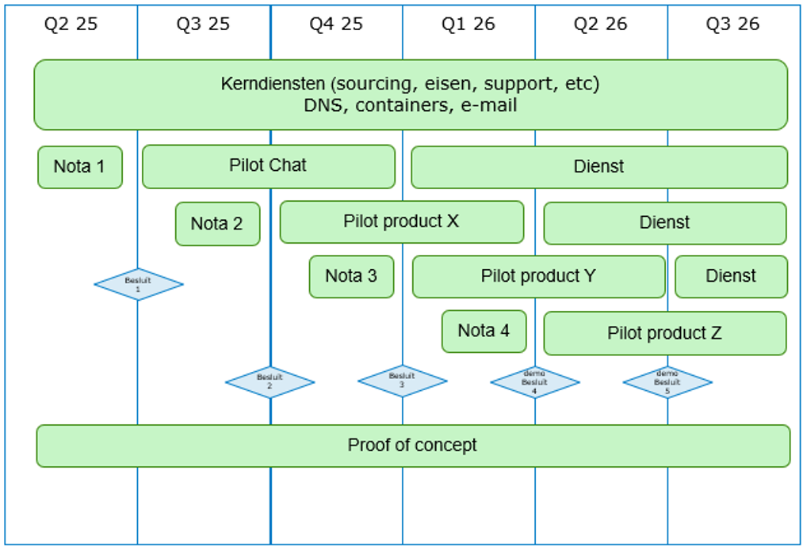

**Project Voorstel**

**Beter Samen Werken**

Open Source, Pilots.

Onderdeel van Open Overheid

| Status        | : Draft              |
| ------------- | -------------------- |
| Versie        | 0.6                  |
| Auteurs       | Rik Hooft            |
| Classificatie | Publiek              |
|               |                      |
| Opdrachtgever | Toine van Oosterhout |
| Datum         | 25-2-2025            |

# 1.2.3. Revisiehistorie

Waar staan we en wie heeft het document allemaal gezien? Wat waren majeure wijzigingen? Door wie is het vastgesteld?

| **Versie** | **Status**          | **Datum** | **Auteur(s)** | **Organisatie(s)** | **Omschrijving** |
| ---------- | ------------------- | --------- | ------------- | ------------------ | ---------------- |
| 0.4        | Review versie       | 2-1-2025  | Rik Hooft     | BZK                |                  |
| 0.5        | Na review Financien | 11-3-2025 | Rik Hooft     | BZK                |                  |

# Distributielijst

_Met wie is het document gedeeld? (werkgroepen et cetera)_

| **Naam**             | **Functie**                                | **Doel**    |
| -------------------- | ------------------------------------------ | ----------- |
| Toine van Oosterhout | Programmamanager                           | Accordering |
| Boris van Hoytema    | Kwartiermaker OSP                          | Accordering |
| Berry den Hartog     | Informatiearchitectuur                     | Ter info    |
| Peter Giskes         | rojectleider                               | Ter info    |
| Arjan Schaeffer      | Projectmanagement IV                       | Ter info    |
| Harry van Irsel      | Baten Manager                              | Ter info    |
| Zoë Meinen           | Programmasecretaris                        | Ter info    |
| Sicco Jan van der    | Strategisch Adviseur Informatievoorziening | Ter info    |

# Inhoud

1. [Managementsamenvatting](#Managementsamenvatting)
2. [Projectdefinitie](#Projectdefinitie)
3. [Projectaanpak](#Projectaanpak)
4. [Projectplanning](#Projectplanning)
5. [Benodigde middelen](#Benodigde-middelen)
6. [Projectorganisatie](#Projectorganisatie)
7. [Gevolgen voor de organisatie](BGevolgen-voor-de-organisatie)
8. [Kwaliteitseisen](#Kwaliteitseisen)

# 1 Managementsamenvatting

In december is Open BSW gestart met een Proof of Concept (PoC) om enkele oplossingen voor samenwerkingssoftware technisch te beproeven. Inmiddels zijn verzoeken ontvangen om eerder dan verwacht te starten met pilots.

De ambities van het project is om producten geschikt te maken zodat ze daadwerkelijk gebruikt kunnen worden genomen om als achter vang te dienen voor de huidige producten. Daarmee heeft het project een hogereambitie dan het beproeven van producten met gebruikers. De implementatie, productieomgeving en rollout van de producten maken geen onderdeel uit van dit projectplan.

Het gaat hierbij om producten die in "Gebruik Open Source-toepassingen voor diensten Digitale Werkomgeving BS" en noodzakelijk zijn voor de vervanging van MS Teams en Sharepoint. Het project stelt voor de pilots uit te voeren in time boxen van elk 6 maanden met een duidelijk beslismoment aan het begin en aan het einde van de pilot. Op basis van actuele voortgang kunnen meer pilots parallel worden gestart. Telkens als een pilot met succes is afgerond kan de beproefde module in gebruik worden genomen.

Doorlooptijd van het project is maximaal 1.5 jaar.

Meeste kosten zijn kosten voor de inzet van overheidspersoneel. Deze kosten zijn nog niet opgenomen in de business case en begroting van 2025. Na besluitvorming in de stuurgroep wie de kosten gaat dragen, zullen deze in de diverse stukken worden opgenomen.De kosten die gebudgetteerd zijn voor de PoC lopen door aangezien het project de wens heeft om de PoC te laten doorlopen.

# 1 Gevraagd besluit

Het project vraagt de stuurgroep te besluiten om akkoord te gaan met dit project voorstel, budget, aanpak en tijdslijnen en het budget voor de eerste pilot ter beschikking te stellen. Totaal zullen er 4 pilots plaatsvinden.

# 2 Projectdefinitie

## 2.1 Aanleiding

In december is Open BSW gestart met een Proof of Concept om enkele oplossingen voor samenwerkingssoftware technisch te beproeven. Bedoeling is om kennis en ervaring op te bouwen waarmee pilots met gebruikers kunnen worden ingericht. Een verzoek om pilots te starten is eind december bij het project ingediend en is inmiddels ingehaald door "Gebruik Open Source-toepassingen voor diensten Digitale Werkomgeving BS". Dit document beschrijft open source achter vang (fallback) voor MS Teams en SharePoint Online en specificeert functioneel wat deze achter vang moet kunnen. Het vergelijkt verschillende open source alternatieven op aanwezigheid van onderstaande modules die samen de functionaliteit van MS Teams en SharePoint Online afdekken:

1\. Bestanden (1)

2\. Video/Audio conference (2)

4\. Chat (3)

5\. Calender (4)

6\. Contacten (4)

7\. Mail (4)

8\. Persoonlijke producten (tekstverwerking, spreadsheet, presentatie)
(1)

9\. Taken (4)

## 2.1 Projectdoel

Het doel van dit project is om te onderzoeken of de Nederlandse rijksoverheidsorganisaties vertegenwoordigd binnen BSW kunnen overstappen op EU gebaseerde opensource alternatieven ter vervanging van Microsoft Teams en Sharepoint online zoals gespecificeerd in, zodat digitale soevereiniteit gewaarborgd kan worden. We doen dat door de functionaliteiten uit "Gebruik Open Source-toepassingen voor diensten Digitale Werkomgeving BS" op basis van Open Source verder uit te werken en deze met gebruikers te beproeven en te verbeteren zodat we voldoen aan gebruikersgemak en wettelijke verplichtingen. Daartoe wordt onderzocht:

i. Of de in EU verband ontwikkelde Open Source producten een achtervang zijn voor MS Teams en Sharepoint Online. Hiervoor willen we met inzet van o.a. gebruikers (groepen) de geschiktheid van de producten onderzoeken en/of de producten geschikt maken voor gebruik bij de Rijksoverheid zodat ze beter zijn voor de ambtenaar dan de huidige oplossingen (fit-for-purpose).

ii. Of deze producten voldoen aan alle moderne eisen op het gebied vaninformatiemanagement (interoperabiliteit, security, privacy, informatiebeheer, beheer(s)baarheid). Daar waar nodig zal het project verbeteringen doorvoeren zodat ze aan deze eisen voldoen.

iii. Welke technische en organisatorische randvoorwaarden ingeregeld moeten worden om deze producten breed binnen het rijk uit te rollen en te beheren.

iv. Of de producten een duurzaam perspectief hebben (doorontwikkeling,bestendigheid).

Deze onderzoeken leiden tot een advies waarmee een afweging kan worden gemaakt of en wanneer overgegaan kan worden op de opensource alternatieven. Een eventuele rollout op productie maakt geen onderdeel uit van dit project.

## 2.2 Gewenst projectresultaat

#### 2.2.1 Omgeving met Kerndiensten bij Rijksdatacenter

Om pilots te kunnen draaien is een technische omgeving nodig. Deze omgeving zal op basis van de ervaringen uit de PoC in een Rijksdatacenter worden ingericht. Op deze omgeving zullen Open Source oplossingen worden geïnstalleerd doorontwikkeld voor de Nederlandse overheid en gedraaid.

#### 2.2.2 Pilots

De open source oplossingen bestaan uit modules zoals chat, videobellen etc. Deze modules zullen elk in een aparte pilot worden beproefd en geschikt worden gemaakt zodat we voldoen aan wettelijke verplichtingen, operationele eisen en eisen met betrekking tot gebruikersvriendelijkheid. Wanneer een pilot is afgerond zal aan de stuurgroep een verslag worden voorgelegd met een voorstel voor het vervolg.

## 2.3 Gewenste einddatum

De periode waarin de pilots zullen plaats vinden is 1.5 jaar. Met een start vanaf 1-5-2025 is de einddatum van dit project: 1-11-2026.

## 2.4 Projectscope

- De in paragraaf 1.2 genoemde pilots

- De omgeving met Kerndiensten

- Architectuur documentatie

- Security maatregelen

- DPIA's

## 2.6 Uitgangspunten en randvoorwaarden

- Open Strategische Autonomie (OSA)

- Gebruik van Rijksdatacenter

- Containerisatie boven Virtualisatie

- Volledig open source software

- Opensourcewerken als werkwijze

- Product installatie & Beheer wordt declaratief opgezet

- Product installatie & Beheer wordt Open Source ontwikkeld

- Informatie-uitwisseling gebeurt met open standaarden

- Product is integreerbaar met OpenID Connect voor gebruiker
  authenticatie

- Zero trust functionaliteit

- Bemensen door overheidspersoneel

- Volgt zoveel als mogelijk BSW architectuur

## 2.7 Internationale samenwerking

Uitgangspunt is dat het project delen hergebruikt van de digitale samenwerkingssoftware van de internationale samenwerkingsorganisaties (La Suite van La Dinum en Opendesk van ZenDis). Dit kan betekenen dat in afstemmen met de internationale collega's samenwerken op sommigemodules zal worden samengewerkt.

# 3 Projectaanpak

## 3.1 Aanpak

Om flexibel te blijven en om te kunnen gaan met onzekerheden en risico's zal elke pilot van een module in een periode van 6 maanden met gebruikers worden beproefd en verbeterd.

Voorafgaand aan de start van een pilot zal aan de stuurgroep een nota met voorstel worden voorgelegd. Hierin zal beschreven welke producten we gaan gebruiken, wat we willen bereiken, meer detail over de kosten zoals benodigde licenties. Na instemming kan tot uitvoering worden over gegaan. Na instemming kan tot uitvoering worden over gegaan.

Binnen de time box van zes maanden zal intensief met senior gebruikers worden samengewerkt om middels directe feedback de modules te verbeteren. Verder willen we kijken of het product binnen de BSW architectuur past en welke stappen nodig zijn als deze nog niet past

Na afloop van de pilot ontvangt de stuurgroep een verslag van de uitgevoerde pilot met de resultaten. Dit betreft de productkwaliteit en wet en regelgeving op hoofdlijnen en een voorstel voor het vervolg en er zal een demo gegeven worden van de resultaten.De volgorde waarin de modules van de pilots worden uitgevoerd is nog niet helemaal bepaald zodat we flexibiliteit bieden. De eerste pilot zal in ieder geval chat zijn. De stuurgroep kan helpen met het vaststellen van de prioriteit en volgorde van de andere drie modules.

### 3.1.2 Beheer

Het project gaat uit van Devops werkwijze toe. Dit betekent dat het team dat de modules hergebruikt ook het team is dat zorg draagt voor het beheer. Binnen BSW zijn SSC-ICT en RVIHH de beheer- en leverende partijen. Zij zullen worden benaderd om actief deel te nemen aan het project om handovers te voorkomen.

## 3.2 Producten

De exacte keuze voor de producten moet nog worden gemaakt. Voorbeelden zijn:

- Chat (Element synapse)

- Office (Collabora + NextCloud)

- Video Bellen (Jitsi/Meet)

- Notities (Docs)

- Mail (OpenXChange)

- AI Interface (OpenWebUI)

- Projectmanagement (OpenProject)

- Kennismanagement (XWIki)

# 4 Projectplanning

Het project wil een periode van maximaal 1.5 jaar pilots uitvoeren met elk met een doorlooptijd van 6 maanden. Daarmee staat de tijd vast en zijn de scope en kosten flexibel en beheerst. Aanvankelijk starten we met 1 module. Naarmate we meer ervaring krijgen kunnen parallel meer pilots worden uitgevoerd of eerder worden opgestart.

# 5 Benodigde middelen

Overzicht van de verwachte kosten is gecommuniceerd via de Baten Manager. Middels de beschreven aanpak met nota's wil het project de uitvoering beheerst houden en de stuurgroep de mogelijkheid bieden om per pilot besluiten te nemen op basis van gedetailleerde kosten. De geschatte kosten voor in totaal 4 pilots zijn 4.1M€, zijnde een optelling van 1.050k€ per pilot. Onderstaand zijn de geraamde kosten zoveel mogelijk nader gespecificeerd.

Opmerkingen:

- Met de uitvoering van dit project wordt ook een deel van de BSW functionaliteit gerealiseerd.

- Project kan besluiten om specifieke onderwerpen uit te besteden

- Kostenraming die gecommuniceerd is wordt verder gevalideerd en voor alsnog gebaseerd op externe inhuur.

# 6 Projectorganisatie

Het project bestaat uit:

| **Rol**              | **Wie**      | **Taken, bevoegdheden, verantwoordelijkheden**               |
| -------------------- | ------------ | ------------------------------------------------------------ | -------- |
| Adviseur OS (OSPO)   | Boris        | Bewaker Open source implementatie                            |
| Product Owner        | Vacature     | Product visie, backlog management                            |
| Community lead       | Rik          | Faciliteren team,rol PM conform BSW                          |
| Tech lead            | Berry        | Platform engineering, technische inrichting, begeleiden devs |
| DevSecOps            | Eric Wout en | Aanpassen modules (front-end, back-end,security,ops)         | Vacature |
| UX                   | Vacature     | Verzamelen, eindgebruikers, informatie en interactie         |
| Beleidsmedewerker    | Vacature     | Doorlopen van DPIA trajecten.                                |
| Gebruikers per pilot | Vacature     | Intensief gebruik van modules en beoordelen op geschiktheid  |
| Specialist           | Vacature     | Inrichten 1e lijn support                                    |

- Het project zal via oproepen stimuleren dat overheidsmedewerkers vrijwillig deel gaan nemen aan het project. Een andere bron zijn samenwerking met andere overheidsonderdelen.

- Het team werkt agile en zal iteratief de producten verbeteren en geschikt maken.

# 6 Documenten en rapportage

Documentatie van het project zal op github plaatsvinden met gebruiken van Open Source standaarden voor documenten.

## 6.1 Rapportagestructuur

Het project rapporteert volgens de BSW werkwijze en heeft aanvullend nota rapportage ingericht om pilots te kunnen besturen.

# 7 Gevolgen voor de organisatie

- Vanuit de kopdepartementen wordt inzet gevraagd van (senior)gebruikers die bijdragen door het formuleren van eisen en wensen voor gebruik van de applicaties. Deze eisen en wensen zullen worden geregistreerd in de backlog van het project.

- Daarnaast wordt de departementen gevraagd om mee te helpen om pilots met organisatieonderdelen te selecteren zodat de applicaties breder gebruikt gaan worden en om draagvlak te vergroten voor mogelijke vervolgstappen.

# 8 Kwaliteitseisen

Voor de kwaliteit en geschiktheid van de te gebruiken producten toets het project aan de hand van functionele geschiktheid, compatibiliteit, gebruiksvriendelijkheid, operationeel, onderhoudbaarheid, overdraagzaamheid en relevante wet en regelgeving. Het project maakt gebruik van onderstaande lijst:

**Wet en regelgeving**

- AVG (GDPR): Privacywetgeving die de verwerking van persoonsgegevens reguleert

- Wet Digitale Overheid: Regels voor identificatie en gegevensuitwisseling

- BIO2: Informatie & cyber beveiliging regelgeving

- AI-Act: AI-systemen wetgeving

- Forum Standaardisatie: Standaarden vastgelegd

- Archiefwet: Levenscyclus van overheidsinformatie

- Wet Open Overheid: Transparantie wetgeving

- Wet Digitale Overheid: Veilige, toegankelijke en betrouwbare digitale communicatie

- NIS2: Cyber beveiliging

- NSCS: basis richtlijnen cyber security

**Functionele geschiktheid**

- 90% van vereiste functies verwacht door gebruikers beschikbaar

**Performance efficiëntie**

- Responsetijd van gemiddelde 300ms (p95)

- Kan 1000 verzoeken per seconden aan (+-750 Gebruikers)

**Compatibiliteit**

- Ondersteund laatste versie van 3 browsers (firefox, edge & chrome)

**Gebruiksvriendelijkheid**

- SUS-score minimaal 75 uit gebruikers onderzoek

**Operationeel**

- Minder dan 5% fouten bij kritieke taken

- Maximaal 30% langer dan benchmark

- Minimaal wettelijke WCAG score

- Betrouwbaarheid (9 tot 5, exclusief weekend)

- MTBF minimaal 1 week

- MTTR minder dan 8 uur

- Beschikbaarheid 98%

- RPO en RTO

- Gebruik CI/CD pipeline voor geautomatiseerde en reproduceerbare releases

**Beveiliging**

- Maximaal 2 kritieke kwetsbaarheden per release, opgelost binnen 72 uur.

- Alle containers moeten gescanned worden op kwetsbaarheden

**Onderhoudbaarheid**

- Heeft mogelijkheid tot gebruikt van open metrics, Logs en traces

- Deployments moeten worden beheerd via declaratieve configuratie

- Minimaal 80% testdekking

- Heeft declaratieve monitoring en alerting

**Overdraagbaarheid**

- Applicaties moeten eenvoudig te deployen zijn op meerdere Kubernetes systemen

- Product wisselt informatie uit via open standaarden zodat we \`best of breed\` kunnen handhaven

- Software kan deployen op on-prem kubernetes en bij cloud providers

BSW Architectuur

- Mate waarin de geselecteerde producten aansluiten aan de BSW architecuur

## 8.1 Eisen en wensen

Op basis van de kwaliteitseisen en de gebruikers input zal een backlog worden gemanaged waar eisen en wensen staan beschrijven, geschat en geprioriteerd. Hiervoor zal een Product Owner worden aangetrokken.
