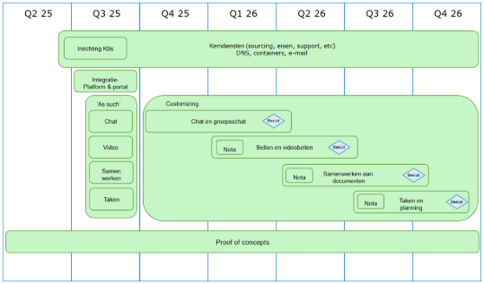
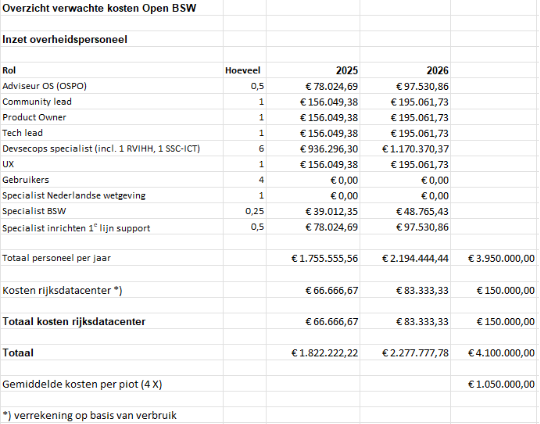

**Projectplan**
 
**Beter Samen Werken**
 
Open BWS (Open Source), Proof of Concept.
 
Onderdeel van Open Overheid
 

|Status|: Draft|
| :- | :- |
|Versie|: 0.7|
|Auteurs|: Rik Hooft|
|Classificatie|: Publiek|
|Opdrachtgever|: Toine van Oosterhout|
|Datum|: 30-4-2025|

## Revisiehistorie

*Waar staan we en wie heeft het document allemaal gezien? Wat waren majeure wijzigingen? Door wie is het vastgesteld?*

|**Versie**|**Status**|**Datum**|**Auteur**|**Organisatie**|**Omschrijving**|
| :- | :- | :- | :- | :- | :- |
|0\.4|1e Review versie|20-1-2025|Rik Hooft|BZK||
|0\.5|Na review Financiën|11-3-2025|Rik Hooft|BZK||
|0\.6|Stuurgroep versie|18-3-2025|Rik Hooft|BZK||
|0\.7|Na verwerking commentaar Stuurgroep|30-4-2025|Rik Hooft|BZK||

## Distributielijst

*Met wie is het document gedeeld? (werkgroepen et cetera)* 	

|**Naam**|**Functie**|**Doel**|
| :- | :- | :- |
|Toine van Oosterhout|Programmamanager|Accordering|
|Boris van Hoytema|Kwartiermaker OSPO|Accordering|
|Berry den Hartog|Informatiearchitectuur|Ter info|
|Peter Giskes|CTO BZK|Ter info|
|Arjan Schaeffer|Projectmanagement IV|Ter info|
|Harry van Irsel|Baten Manager|Ter info|
|Zoë Meinen|Programmasecretaris|Ter info|
|Sicco Jan van der Meulen|Strategisch Adviseur Informatievoorziening|Ter info|

## Inhoud

[Revisiehistorie	2**](#_toc192574527)**

[**Distributielijst	2**](#_toc192574528)

[**Inhoud	3**](#_toc192574529)

[**1 Managementsamenvatting	4**](#_toc192574530)

[**1 Gevraagd besluit	4**](#_toc192574531)

[**2 Projectdefinitie	4**](#_toc192574532)

[2.1 Aanleiding	4](#_toc192574533)

[2.1 Projectdoel	4](#_toc192574534)

[2.2 Gewenst projectresultaat	5](#_toc192574535)

[2.3 Gewenste einddatum	5](#_toc192574536)

[2.4 Projectscope	5](#_toc192574537)

[2.5 Niet in scope	5](#_toc192574538)

[2.6 Uitgangspunten en randvoorwaarden	6](#_toc192574539)

[2.7 Internationale samenwerking	6](#_toc192574540)

[**3 Projectaanpak	7**](#_toc192574541)

[3.1 Aanpak	7](#_toc192574542)

[*3.1.2 Beheer	7*](#_toc192574543)

[3.2 Producten	7](#_toc192574544)

[**4 Projectplanning	8**](#_toc192574545)

[**5 Benodigde middelen	8**](#_toc192574546)

[**6 Projectorganisatie	9**](#_toc192574547)

[**6 Documenten en rapportage	9**](#_toc192574548)

[6.1 Rapportagestructuur	9](#_toc192574549)

[**7 Gevolgen voor de organisatie	10**](#_toc192574550)

[**8 Kwaliteitseisen	10**](#_toc192574551)

[8.1 Eisen en wensen	12](#_toc192574552)

[**9 Fasering van de pilot	12**](#_toc192574553)

#  1 Managementsamenvatting

In december 2024 is Open BSW gestart met een Proof of Concept (PoC) om enkele oplossingen voor samenwerkingssoftware technisch te beproeven. Inmiddels zijn verzoeken ontvangen om eerder dan verwacht te starten met pilots.

Binnen BSW loopt de uitrol van Microsoft Teams vast. Enerzijds speelt de zorg rondom digitale soevereiniteit een rol, terwijl anderzijds een concreet alternatief ontbreekt. Dit project streeft ernaar hierin verandering te brengen door pilots op te zetten waarin een op Open Source gebaseerd alternatief voor Microsoft  Teams worden getest met eindgebruikers.

De ambities van het project is om dit alternatief geschikt te maken zodat ze daadwerkelijk gebruikt kunnen worden genomen om als achtervang te dienen voor Microsoft  Teams. Daarmee heeft het project een hogere ambitie dan het beproeven van producten met gebruikers. De implementatie, productieomgeving en rollout van de producten maken geen onderdeel uit van dit projectplan.

Het project stelt voor om te beginnen met een pilot gericht op chat- en groepschatfunctionaliteiten, waarna dit stapsgewijs kan worden uitgebreid met andere onderdelen die nodig zijn om Microsoft  Teams te vervangen. Tegelijkertijd zal worden onderzocht op welke manier de IHH-eisen kunnen worden geïntegreerd. Daarnaast gaat het project bouwen aan koppelvlakken voor bestaande software en diensten. Op basis van de voortgang kunnen aanvullende pilots parallel worden uitgevoerd. Na succesvolle afronding van een pilot kan de geteste module in gebruik worden genomen.

Doorlooptijd van het project is maximaal 1.5 jaar.

Meeste kosten zijn kosten voor de inzet van overheidspersoneel. Deze kosten zijn nog niet opgenomen in de business case en begroting van 2025. Na besluitvorming in de stuurgroep wie de kosten gaat dragen, zullen deze in de diverse stukken worden opgenomen.

De kosten die gebudgetteerd zijn voor de PoC lopen door aangezien het project de wens heeft om de PoC als proeftuin te laten doorlopen.

# 1 Gevraagd besluit

Het project vraagt de stuurgroep te besluiten om akkoord te gaan met dit project voorstel, budget, aanpak en tijdslijnen en het budget voor de eerste pilot ter beschikking te stellen. Totaal zullen er 4 pilots plaatsvinden.

# 2 Projectdefinitie

## 2.1 Aanleiding

In december is Open BSW begonnen met een Proof of Concept om verschillende oplossingen voor samenwerkingssoftware technisch te evalueren. Het doel is om kennis en ervaring op te doen die gebruikt kan worden om pilots met gebruikers op te zetten.

Eind december is bij het project een verzoek ingediend om pilots te starten. Dit verzoek is inmiddels ingehaald door het document “Gebruik Open Source-toepassingen voor diensten Digitale Werkomgeving BS.” Dit document beschrijft een Open Source fallback (achtervang) voor onder andere Microsoft  Teams en specificeert de functionele vereisten waaraan deze achter vang moet voldoen. Het bevat een vergelijking van verschillende oplossingen op basis van de aanwezigheid van onderstaande modules, die samen de beoogte deelfunctionaliteit binnen BSW waar Microsoft  Teams als oplossing was voorzien moeten afdekken.

## 2\.1 Wens van de stuurgroep

De stuurgroep heeft na het overleg van 15 april 2025 verzocht om het projectplan toe te spitsen op:

1. Vervanging Microsoft  Teams met Video en Chatfunctionaliteit, onderliggende SharePoint en OneDrive
1. Koppelen aan Microsoft producten (vooralsnog vooral KA applicaties zoals Word; PowerPoint en Excel) die door andere partijen worden beheerd en beschikbaar worden gesteld aan Open BSW
1. Voldoen aan de IHH eisen (wet- en regelgeving en kaders opgesteld binnen programma zoals bijvoorbeeld werkgroep IHH en CIO rijk beleidskaders)
1. Flexibele structuur zodat modules snel kunnen worden gewisseld indien gewenst

## 2.1 Projectdoel

Het doel van dit project is om te beoordelen of de Nederlandse rijksoverheidsorganisaties, vertegenwoordigd binnen BSW, kunnen overstappen op soevereine en autonome oplossingen waar nu Microsoft Teams word voorzien binnen BSW, zoals gespecificeerd in de doelarchitectuur.

Dit wordt gerealiseerd op basis van wat er in de Proof of Concept Open BSW is geconstateerd en door de functionaliteiten uit “Gebruik Open Source-toepassingen voor diensten Digitale Werkomgeving BSW” verder te ontwikkelen. Vervolgens worden deze functionaliteiten getest en verbeterd in samenwerking met gebruikers, met als doel om een kwalitatief goede oplossing te realiseren voor waar nu Microsoft  Teams is voorzien in de doelarchitectuur BSW.

Om dit te bereiken, wordt onderzocht:

1. Of de bij Open BSW beproefde producten de rol van Microsoft Teams kunnen vervangen, hetzij als achtervang of als gekozen oplossing. Hiervoor willen we met inzet van o.a. gebruikers (groepen) de geschiktheid van de producten onderzoeken en/of de producten geschikt maken voor gebruik bij de Rijksoverheid zodat ze beter zijn voor de ambtenaar dan de huidige oplossingen (fit-for-purpose).
1. Of deze producten voldoen aan alle moderne eisen op het gebied van informatiemanagement (interoperabiliteit, security, privacy, informatiebeheer, beheer(s)baarheid) en met name op het gebied van informatiehuishouding. Daar waar nodig zal het project verbeteringen (laten) doorvoeren zodat ze aan deze eisen voldoen.
1. Welke technische en organisatorische randvoorwaarden ingeregeld moeten worden om deze producten breed binnen het rijk uit te rollen en te beheren.
1. Of andere partijen kunnen koppelen aan de producten die doorontwikkeld worden door Open BSW om zo de interdepartementale en overheidssamenwerkingen te kunnen versterken.
1. Of de producten een duurzaam perspectief hebben (doorontwikkeling, bestendigheid).

Deze onderzoeken leiden tot een advies waarmee een afweging kan worden gemaakt of en wanneer overgegaan kan worden op de Open BSW oplossingen. Een eventuele gang naar productie maakt geen onderdeel uit van dit project.

## 2.2 Gewenst projectresultaat

### 2\.2.1	Omgeving met Kerndiensten bij Rijksdatacenter

Om pilots te kunnen draaien is een technische omgeving nodig. Deze omgeving zal op basis van de ervaringen uit de PoC in een Rijksdatacenter worden ingericht. Op deze omgeving zullen Open Source oplossingen worden geïnstalleerd doorontwikkeld voor de Nederlandse overheid en gedraaid.

### 2\.2.1	Integratie laag

Het project streeft naar maximaal hergebruik en samenwerken met publieke organisaties. De infrastructuur als code werkwijze maakt het mogelijk om componenten, zoals containers, geautomatiseerd te deployen, uit te voeren en te beheren. De componenten zijn open source en vrij beschikbaar, en worden op die basis geïntegreerd in Mijn Bureau.

Bij wijzigingen in de onderliggende componentent proberen we samen te werken met de betrokken partijen om de wijzigingen bij hen in beheer te brengen. Wijzigingen worden vanuit het project voorgesteld aan de beheerder van het betreffende component—doorgaans via GitHub. Indien deze wijzigingen worden geaccepteerd, worden ze doorgevoerd in de broncode. Mocht blijken dat essentiele wijzigingen niet worden gehonoreerd dan kan besloten worden om de repository waarin de brondcode is opgeslagen te forken. Dit betekent dat a.h.w. een kopie van de oorspronkelijk repository wordt gemaakt die we in eigen beheer verder ontwikkelen. Het forken van componenten probeert het project zoveel mogelijk te vermijden, aangezien dit kan leiden tot fragmentatie en extra onderhoudslast.

Wanneer dit leidt tot essentiële besluitvorming, wordt dit voorgelegd aan de stuurgroep.

### 2\.2.2	Vier pilots die gezamenlijk een alternatief vormen voor Microsoft Teams

De oplossingen bestaan uit functies zoals chat, videobellen etc. Deze functies zullen elk in een aparte pilot worden beproefd en geschikt worden gemaakt zodat we voldoen aan wettelijke verplichtingen, operationele eisen en eisen met betrekking tot gebruikersvriendelijkheid. Wanneer een pilot is afgerond zal aan de stuurgroep een verslag worden voorgelegd met een voorstel voor het vervolg.

### 2\.2.3	Functionaliteit die voorheen met Microsoft Teams werd voorzien

De definitie van wat Microsoft Teams omvat is niet functioneel of strak omlijnd. Om te komen tot de definitie van een oplossing moeten we de componenten benoemen die nodig zijn om binnen het Rijk de zelfde functies te bieden voor de medewerkers. Op basis van informatie uit het strategisch overleg tussen CIO BZK en SSC-ICT hebben ontvangen baseren het project zich op de volgende 4 functionaliteiten die onderdeel uitmaken van de Minimum Viable Product (MVP):

1\.	Chat en groeps chat

2\.	Bellen en videobellen

3\.	Samenwerken aan documenten

4\.	Taken en planning

De volgende functionaliteiten, die ook in Microsoft  Teams aanwezig zijn, vallen buiten de scope van het MVP en maken daarom geen deel uit van dit projectvoorstel:

5\.	Agenda	

6\.	Whiteboarding

7\. Business processen

   ### 2\.2.4	Koppelingen met Microsoft of andere Closed Source producten

   De Stuurgroep geeft partijen zoals RVIHH of SSC-ICT, opdracht om (mee te werken om) koppelingen te maken met Open BSW en informatie te verschaffen hoe de interfaces in detail/technisch werken zodat Open BSW kan deze interfaces kan bieden. Met deze informatie kan Open BSW een rapport opleveren hoe de koppeling kan plaatsvinden dan wel de koppeling realiseren.

## 2.3 Gewenste einddatum

De periode waarin de pilots zullen plaats vinden is 1.5 jaar.  Met een start vanaf 1-6-2025 is de einddatum van dit project: 1-12-2026.

## 2.4 Projectscope

- De in paragraaf 2.2.2 bij MVP genoemde pilots
- De omgeving met Kerndiensten
- Architectuur documentatie
- Security maatregelen
- DPIA’s en DTIA’s

## 2.5 Uitgangspunten en randvoorwaarden

- Maximale inzet op hergebruik, fit-for-purpose, en samenwerken
- Open Strategische Autonomie (OSA)
- Gebruik van Rijksdatacenter
- Containerisatie boven Virtualisatie
- Alle software is herbruikbaar, bestudeerbaar, bewerkbaar en deelbaar en komt met een standaardlicentie van de OSI-lijst (open source als randvoorwaarde)
- Opensourcewerken als werkwijze
- Product installatie & Beheer wordt declaratief opgezet
- Product installatie & Beheer wordt Open Source ontwikkeld
- Informatie-uitwisseling gebeurt met open standaarden
- Product is integreerbaar met OpenID Connect voor gebruiker authenticatie
- Zero trust filosofie
- Volgt zoveel als mogelijk BSW architectuur
- Agile project
- Samenwerken met de Nederlandse publieke sector met Mijn Bureau

## 2.7 Europese en nationale samenwerking

Uitgangspunt is dat het project delen hergebruikt van de digitale samenwerkingssoftware van de internationale samenwerkingsorganisaties (La Suite van DINUM en Opendesk van ZenDiS). Dit kan betekenen dat in afstemmen met de internationale collega’s samenwerking zal worden gezocht en waar mogelijk kan worden samengewerkt.

Waar andere Nederlandse overheden kunnen en willen bijdragen aan het project word er met hen samengewerkt, om zo zowel de acceptatie als schalingsmogelijkheden te vergroten. Dit door middel van het samenwerken aan broncode in het Mijn Bureau project.

# 3 Projectaanpak

## 3.1 Aanpak

We werken Agile. Dit betekent dat we met risico’s en onzekerheid omgaan door in kleine stappen te werken. Zo zal voorafgaand aan de start van een pilot een nota aan de stuurgroep worden voorgelegd. Hierin zal beschreven worden welke producten we gaan gebruiken, wat we willen bereiken, planning en meer detail over de kosten zoals benodigde diensten en expertondersteuning. Na instemming kan tot uitvoering worden over gegaan.

Het project zal starten met het inrichten van een Kubernetes omgeving waar de producten zullen worden geïnstalleerd. Parallel zal een integratie laag worden ontwikkeld en een basaal bureaublad. Vervolgens zullen alle producten die nodig zijn voor de pilotdoelstelling van de Microsoft Teams functionaliteit in 1 keer worden geïnstalleerd.  

Elke pilot is een time box van zes maanden waarbinnen intensief met senior gebruikers word samengewerkt om middels directe feedback de producten te verbeteren. Verder willen we kijken of het product binnen de BSW architectuur past en welke stappen nodig zijn als deze nog niet past. We weten op voorhand niet of 6 maanden voldoende is maar willen wel overzicht houden in waar we staan.

Na afloop van de pilot ontvangt de stuurgroep een verslag van de uitgevoerde pilot met de resultaten. Dit betreft de productkwaliteit en wet en regelgeving en een voorstel voor het vervolg en er zal een demo gegeven worden van de resultaten.

Het project stelt de volgende volgorde voor:

1\.	Chat en groeps chat

2\.	Bellen en videobellen

3\.	Samenwerken aan documenten

4\.	Taken en planning

De stuurgroep kan helpen met het vaststellen van de prioriteit en volgorde van de  drie volgende modules.

### 3.1.2 Beheer

Het project gaat uit van Devops werkwijze toe. Dit betekent dat het team dat de modules hergebruikt ook het team is dat zorg draagt voor het beheer. Binnen BSW zijn SSC-ICT en RVIHH de beheer- en leverende partijen. Zij zullen worden benaderd om actief deel te nemen aan het project om handovers te voorkomen. Opdrachtverstrekking aan deze partijen zal door de stuurgroep worden gedaan.

## 3.2 Producten

Producten, componenten en modules worden op een fit-for-purpose manier gekozen. Voorbeelden zijn:

- Chat (Element synapse)
- Office (Collabora + NextCloud)
- Video Bellen (Jitsi/Meet)
- Notities (Docs)
- Mail (OpenXChange)
- AI Interface (OpenWebUI)
- Projectmanagement (OpenProject)
- Kennismanagement (XWIki)

||
| :- |
# 4 Projectplanning

Het project wil een periode van maximaal 1.5 jaar pilots uitvoeren met elk met een doorlooptijd van 6 maanden. Daarmee staat de tijd vast en zijn de scope en kosten flexibel en beheerst. We starten met het beschikbaar maken van de producten ‘as such’ en gaan ons vervolgens focussen op het eerst product (chat en groepschat). Naarmate we meer ervaring krijgen kunnen parallel meer pilots worden uitgevoerd of eerder worden opgestart.

# 5 Benodigde middelen

Onderstaand overzicht toont de verwachte kosten. Middels de beschreven aanpak met nota’s wil het project de uitvoering beheerst houden en de stuurgroep de mogelijkheid bieden om per pilot besluiten te nemen op basis van gedetailleerde kosten.

De geschatte kosten voor in totaal 4 pilots zijn 4.1M€, zijnde een optelling van 1.050k€ per pilot. Onderstaand zijn de geraamde kosten zoveel mogelijk nader gespecificeerd.  

**Opmerkingen:**

- Met de uitvoering van dit project wordt ook een deel van de BSW functionaliteit gerealiseerd.

- Project kan besluiten om specifieke onderwerpen uit te besteden

- Kostenraming die gecommuniceerd is wordt verder gevalideerd en voor alsnog gebaseerd op externe inhuur.

# 6 Projectorganisatie

Het project bestaat uit:

|**Rol**|**Wie**|**Taken, bevoegdheden, verantwoordelijkheden**|
| :- | :- | :- |
|Adviseur OS (OSPO) *|Boris|Bewaker en adviseur Open Source|
|Product Owner|Vacature|Product visie, backlog management|
|Community lead|Rik|Faciliteren team, rol PM conform BSW|
|Tech lead|Berry|Platform engineering, technische inrichting, begeleiden devs|
|DevSecOps (front-end, back end,security,ops)|Eric Wout en vacature|Aanpassen modules|
|UX **|Vacature|Verzamelen eindgebruikers informatie en interactie|
|Beleidsmedewerker DPIA ***|Vacature|Doorlopen van DPIA trajecten.|
|Gebruikers per pilot|Vacature|Intensief gebruik van modules en beoordelen op geschiktheid|
|Specialist inrichten 1e lijn support|Vacature|Inrichten 1e lijn support.|

\* De adviseur OS stemt af met de QA van programma en de QA zorgt dat waar nodig zaken geagendeerd worden op de stuurgroep

\*\* Waar dat kan zal gebruik gemaakt worden van de kennis/expertise van de UX designers van RvIHH m.b.t. gebruikersschermen.

\*\*\* Kennis/expertise zal geleverd worden vanuit het project implementatie/harmonisatie waar realiseren van DPIA’s is belegd.

- Het project zal via oproepen stimuleren dat overheidsmedewerkers en overheden vrijwillig deel gaan nemen aan het project. Een andere bron zijn samenwerking met andere overheidsonderdelen.

- Het team werkt agile en zal iteratief de producten verbeteren en geschikt maken.

# 6 Documenten en rapportage

Documentatie van het project zal op github plaatsvinden met gebruiken van Open Source standaarden voor documenten.

## 6.1 Rapportagestructuur

Het project rapporteert volgens de BSW werkwijze en heeft aanvullend nota rapportage ingericht om pilots te kunnen besturen.  

# 7 Gevolgen voor de organisatie

- Vanuit de kopdepartementen wordt inzet gevraagd van (senior) gebruikers die bijdragen door het formuleren van eisen en wensen voor gebruik van de applicaties. Deze eisen en wensen zullen worden geregistreerd in de backlog van het project.
- Daarnaast wordt de departementen gevraagd om  mee te helpen om pilots met organisatieonderdelen te selecteren zodat de applicaties breder gebruikt gaan worden en om draagvlak te vergroten voor mogelijke vervolgstappen.

# 8 Kwaliteitseisen

Voor de kwaliteit en geschiktheid van de te gebruiken producten toets het project aan de hand van functionele geschiktheid, compatibiliteit, gebruiksvriendelijkheid, operationeel, onderhoudbaarheid, overdraagzaamheid en relevante wet en regelgeving.  Het project maakt gebruik van onderstaande lijst:

**Wet en regelgeving**

- AVG (GDPR): Privacywetgeving die de verwerking van persoonsgegevens reguleert
- Wet Digitale Overheid: Regels voor identificatie en gegevensuitwisseling
- BIO2: Informatie & cyber beveiliging regelgeving
- AI-Act: AI-systemen wetgeving
- Forum Standaardisatie: Standaarden vastgelegd
- Archiefwet: Levenscyclus van overheidsinformatie
- Wet Open Overheid: Transparantie wetgeving
- Wet Digitale Overheid: Veilige, toegankelijke en betrouwbare digitale communicatie
- NIS2: Cyber beveiliging
- NSCS: basis richtlijnen cyber security

**Functionele geschiktheid**

- 90% van vereiste functies verwacht door gebruikers beschikbaar

**Performance efficiëntie**

- Responsetijd van gemiddelde 300ms (p95)
- Kan 1000 verzoeken per seconden aan (+-750 Gebruikers)

**Compatibiliteit**

- Ondersteund laatste versie van 3 browsers (firefox, edge & chrome)

**Gebruiksvriendelijkheid**

- SUS-score minimaal 75 uit gebruikers onderzoek

**Operationeel**

- Minder dan 5% fouten bij kritieke taken
- Maximaal 30% langer dan benchmark
- Minimaal wettelijke WCAG score
- Betrouwbaarheid (9 tot 5, exclusief weekend)
- MTBF minimaal 1 week
- MTTR minder dan 8 uur
- Beschikbaarheid 98%
- RPO en RTO
- Gebruik CI/CD pipeline voor geautomatiseerde en reproduceerbare releases

**Beveiliging**

- Maximaal 2 kritieke kwetsbaarheden per release, opgelost binnen 72 uur.
- Alle containers moeten gescanned worden op kwetsbaarheden

**Onderhoudbaarheid**

- Heeft mogelijkheid tot gebruikt van open metrics, Logs en traces
- Deployments moeten worden beheerd via declaratieve configuratie
- Minimaal 80% testdekking
- Heeft declaratieve monitoring en alerting

**Overdraagbaarheid**

- Applicaties moeten eenvoudig te deployen zijn op meerdere Kubernetes systemen
- Product wisselt informatie uit via open standaarden zodat we `best of breed` kunnen handhaven
- Software kan deployen op on-prem kubernetes en bij cloud providers

**BSW Architectuur en IHH**

- Mate waarin de geselecteerde producten aansluiten aan de BSW architecuur
- Mate waarin de geselecteerde producten aansluiten bij de IHH eisen

8.1 Eisen en wensen

Op basis van de kwaliteitseisen en de gebruikers input zal een backlog worden gemanaged waar eisen en wensen staan beschrijven, geschat en geprioriteerd. Hiervoor zal een Product Owner worden aangetrokken.

Versie: 0.7	 	Pagina 15** van 20** 

